# Tachiwin-OCR-1.5 Evaluation Report

1000-page benchmark · uncommon_char_score ≥ 0.4  |  Run: 2026-07-14 17:30:01

**Base model:** [PaddleOCR-VL-1.5](https://huggingface.co/PaddlePaddle/PaddleOCR-VL-1.5)  ·  **Fine-tuned model:** [Tachiwin-OCR-1.5](https://huggingface.co/tachiwin/Tachiwin-OCR-1.5)

Significance (paired t-test, base CER vs fine-tuned CER within group): *** p<0.001  ** p<0.01  * p<0.05  ns=not significant

Overall: base CER 0.7600 → ft CER 0.2210 (−33.5% relative)

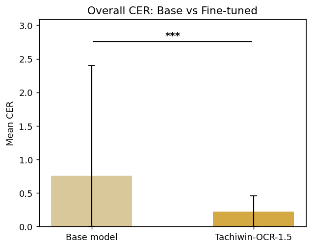

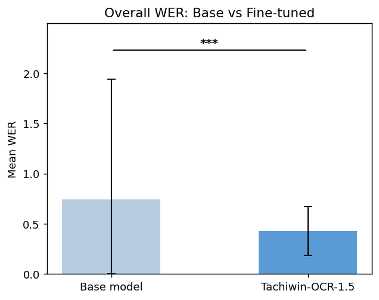

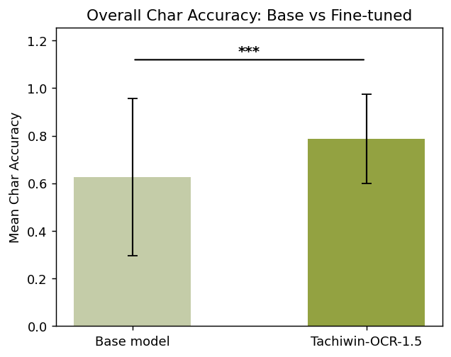

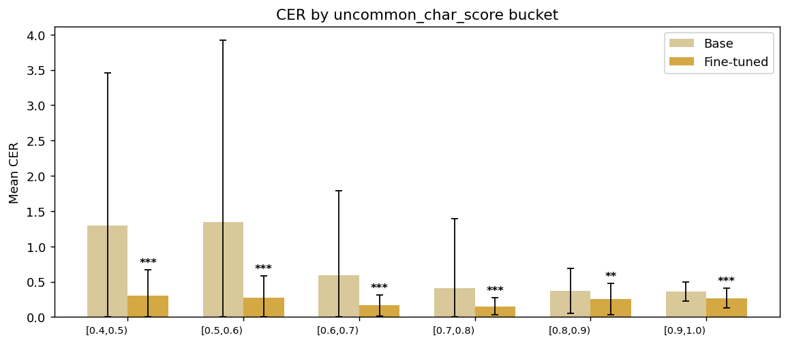

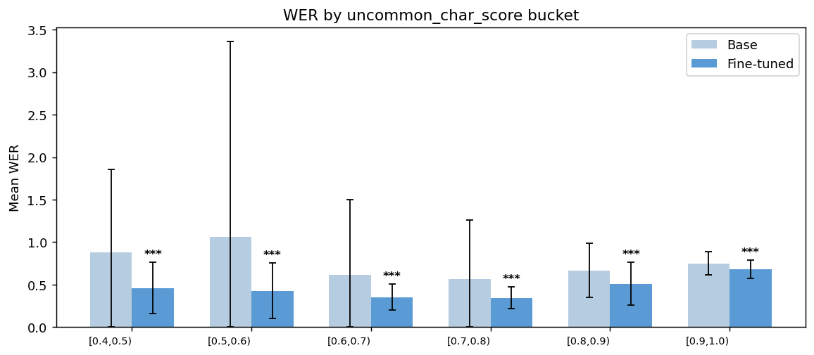

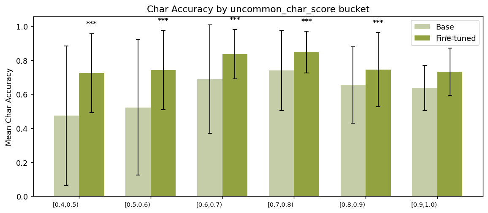

## By uncommon_char_score bucket

| Score range   |   Pages |   Base CER |   Fine-tuned CER | CER Improvement   |   Base WER |   Fine-tuned WER |   Base Char Accuracy |   Fine-tuned Char Accuracy |   p-value | Significance   |
|:--------------|--------:|-----------:|-----------------:|:------------------|-----------:|-----------------:|---------------------:|---------------------------:|----------:|:---------------|
| [0.4, 0.5)    |     165 |     1.2947 |           0.3037 | 76.5%             |     0.8796 |           0.4587 |               0.4737 |                     0.7244 |   0       | ***            |
| [0.5, 0.6)    |     173 |     1.3458 |           0.2734 | 79.7%             |     1.0585 |           0.4285 |               0.523  |                     0.7426 |   0       | ***            |
| [0.6, 0.7)    |     281 |     0.5891 |           0.1647 | 72.0%             |     0.6185 |           0.3526 |               0.6889 |                     0.836  |   0       | ***            |
| [0.7, 0.8)    |     211 |     0.4058 |           0.1518 | 62.6%             |     0.5626 |           0.3428 |               0.7401 |                     0.8482 |   7e-05   | ***            |
| [0.8, 0.9)    |      45 |     0.3702 |           0.2556 | 30.9%             |     0.6666 |           0.5091 |               0.6551 |                     0.7454 |   0.00167 | **             |
| [0.9, 1.0)    |     118 |     0.362  |           0.2669 | 26.3%             |     0.7512 |           0.6838 |               0.638  |                     0.7331 |   0       | ***            |

## By code (n ≥ 3)

| code   |   Pages |   Base CER |   Fine-tuned CER | CER Improvement   |   Base WER |   Fine-tuned WER |   Base Char Accuracy |   Fine-tuned Char Accuracy |   p-value | Significance   |
|:-------|--------:|-----------:|-----------------:|:------------------|-----------:|-----------------:|---------------------:|---------------------------:|----------:|:---------------|
| amu    |     312 |     1.0389 |           0.2139 | 79.4%             |     0.857  |           0.4003 |               0.5475 |                     0.7903 |   0       | ***            |
| lac    |     218 |     0.2011 |           0.1373 | 31.7%             |     0.4191 |           0.3281 |               0.8178 |                     0.8627 |   0.00187 | **             |
| chz    |     184 |     0.4395 |           0.2672 | 39.2%             |     0.7536 |           0.6343 |               0.6211 |                     0.7328 |   6e-05   | ***            |
| maj    |      52 |     2.6131 |           0.2789 | 89.3%             |     1.2654 |           0.3337 |               0.3171 |                     0.7247 |   1e-05   | ***            |
| zae    |      46 |     1.4471 |           0.3078 | 78.7%             |     1.0276 |           0.5992 |               0.4507 |                     0.6922 |   1e-05   | ***            |
| vmp    |      33 |     0.1308 |           0.0728 | 44.3%             |     0.335  |           0.2811 |               0.8692 |                     0.9272 |   0       | ***            |
| zad    |      22 |     0.5573 |           0.5152 | 7.6%              |     0.7813 |           0.7131 |               0.6337 |                     0.6723 |   0.06089 | ns             |
| xtn    |      20 |     1.1812 |           0.2456 | 79.2%             |     0.7961 |           0.3975 |               0.4606 |                     0.7544 |   0.01101 | *              |
| poi    |      15 |     0.1559 |           0.0801 | 48.6%             |     0.5742 |           0.236  |               0.8441 |                     0.9199 |   0       | ***            |
| meh    |      13 |     0.4038 |           0.2359 | 41.6%             |     0.6083 |           0.2739 |               0.6836 |                     0.7677 |   0.15755 | ns             |
| vmz    |      12 |     0.1922 |           0.3525 | -83.4%            |     0.2744 |           0.3489 |               0.8078 |                     0.783  |   0.34247 | ns             |
| ztg    |      10 |     0.2458 |           0.0749 | 69.5%             |     0.4994 |           0.2529 |               0.7542 |                     0.9251 |   0.00186 | **             |
| zca    |       7 |     0.2539 |           0.1826 | 28.1%             |     0.4403 |           0.1319 |               0.7461 |                     0.8174 |   0.00181 | **             |
| mxb    |       7 |     0.2717 |           0.2731 | -0.5%             |     0.4706 |           0.5243 |               0.7283 |                     0.7269 |   0.88659 | ns             |
| zpf    |       6 |     0.7919 |           0.7526 | 5.0%              |     0.4295 |           0.2596 |               0.2725 |                     0.3042 |   1e-05   | ***            |
| mim    |       5 |     0.6017 |           0.1092 | 81.9%             |     0.4328 |           0.1703 |               0.5719 |                     0.8908 |   0.1757  | ns             |
| zpc    |       4 |     1.465  |           0.1784 | 87.8%             |     1.2348 |           0.4672 |               0.4288 |                     0.8216 |   0.23617 | ns             |
| cuc    |       4 |     0.4236 |           0.423  | 0.1%              |     0.8218 |           0.6736 |               0.5764 |                     0.577  |   0.98474 | ns             |
| cle    |       3 |     0.8594 |           0.0971 | 88.7%             |     0.7045 |           0.2619 |               0.5834 |                     0.9029 |   0.38902 | ns             |
| maa    |       3 |     1.4269 |           0.2046 | 85.7%             |     0.9245 |           0.3769 |               0.1063 |                     0.7954 |   0.17    | ns             |
| jmx    |       3 |     0.3156 |           0.2556 | 19.0%             |     0.5993 |           0.554  |               0.6844 |                     0.7444 |   0.38097 | ns             |
| ote    |       3 |     0.0701 |           0.0654 | 6.8%              |     0.1956 |           0.2017 |               0.9299 |                     0.9346 |   0.32438 | ns             |
| mix    |       3 |     1.4943 |           0.5376 | 64.0%             |     0.9199 |           0.5294 |               0.3653 |                     0.4624 |   0.3894  | ns             |

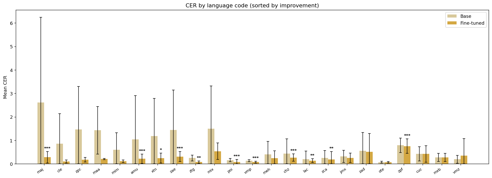

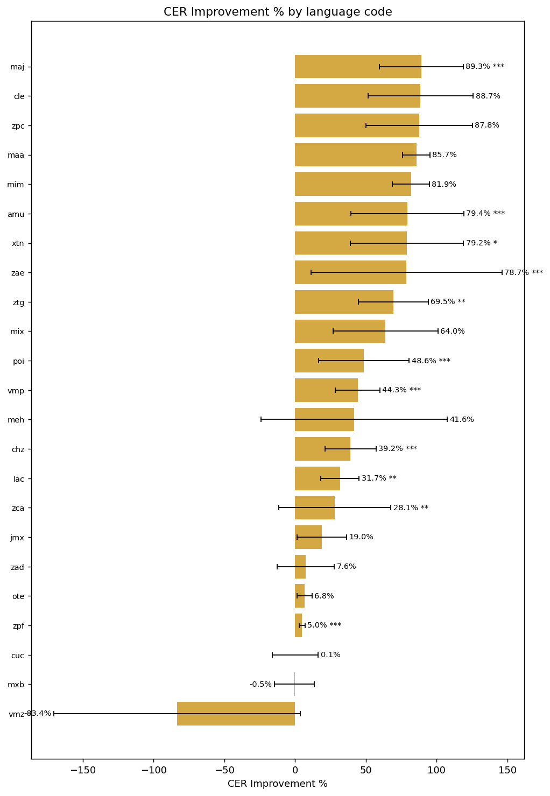

## By superlanguage (n ≥ 3)

| superlanguage   |   Pages |   Base CER |   Fine-tuned CER | CER Improvement   |   Base WER |   Fine-tuned WER |   Base Char Accuracy |   Fine-tuned Char Accuracy |   p-value | Significance   |
|:----------------|--------:|-----------:|-----------------:|:------------------|-----------:|-----------------:|---------------------:|---------------------------:|----------:|:---------------|
| Amuzgo          |     312 |     1.0389 |           0.2139 | 79.4%             |     0.857  |           0.4003 |               0.5475 |                     0.7903 |   0       | ***            |
| Lacandón        |     218 |     0.2011 |           0.1373 | 31.7%             |     0.4191 |           0.3281 |               0.8178 |                     0.8627 |   0.00187 | **             |
| Chinanteco      |     191 |     0.4457 |           0.2678 | 39.9%             |     0.7542 |           0.6293 |               0.6196 |                     0.7322 |   3e-05   | ***            |
| Mazateco        |     100 |     1.4678 |           0.2175 | 85.2%             |     0.8292 |           0.3194 |               0.5519 |                     0.8006 |   2e-05   | ***            |
| Zapoteco        |      77 |     1.0727 |           0.2918 | 72.8%             |     0.8616 |           0.4842 |               0.515  |                     0.7126 |   0       | ***            |
| Mixteco         |      53 |     0.7487 |           0.2485 | 66.8%             |     0.662  |           0.384  |               0.5799 |                     0.7524 |   0.00122 | **             |
| Popoluca        |      15 |     0.1559 |           0.0801 | 48.6%             |     0.5742 |           0.236  |               0.8441 |                     0.9199 |   0       | ***            |
| Otomí           |       3 |     0.0701 |           0.0654 | 6.8%              |     0.1956 |           0.2017 |               0.9299 |                     0.9346 |   0.32438 | ns             |

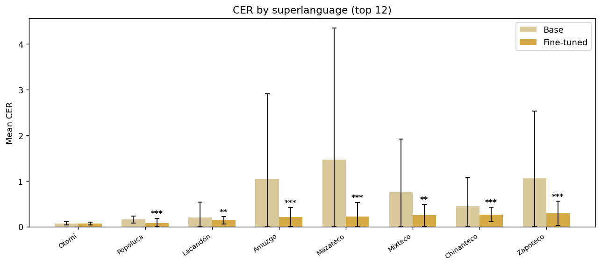

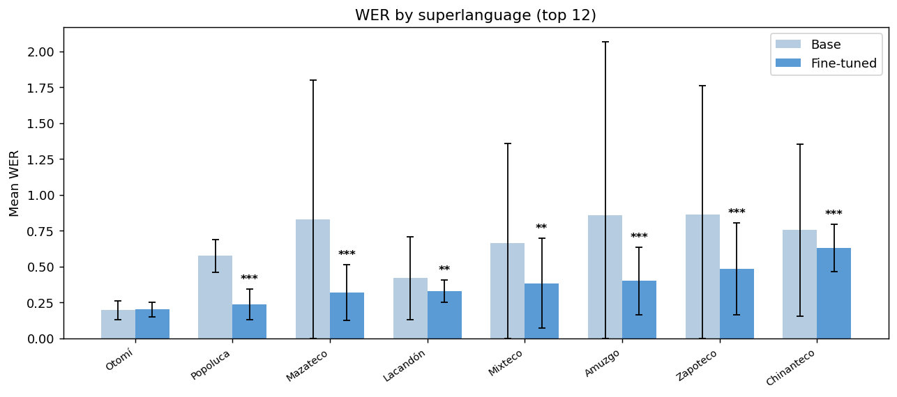

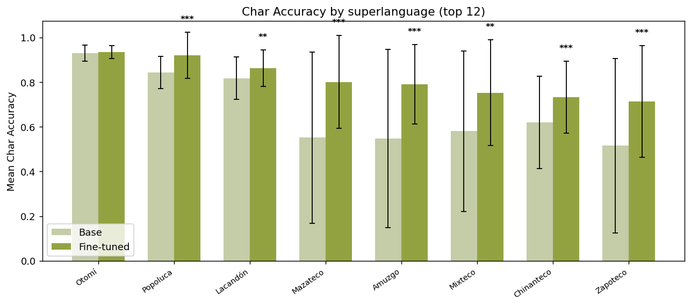

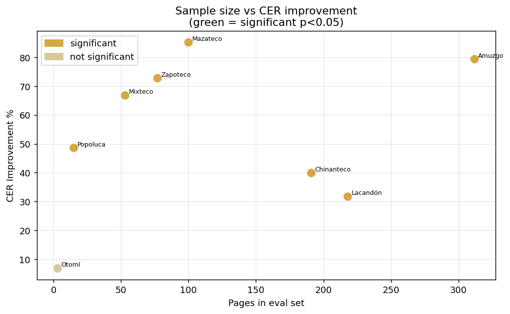

## By family (n ≥ 3)

| family        |   Pages |   Base CER |   Fine-tuned CER | CER Improvement   |   Base WER |   Fine-tuned WER |   Base Char Accuracy |   Fine-tuned Char Accuracy |   p-value | Significance   |
|:--------------|--------:|-----------:|-----------------:|:------------------|-----------:|-----------------:|---------------------:|---------------------------:|----------:|:---------------|
| Otomangue     |     736 |     0.922  |           0.2384 | 74.1%             |     0.8103 |           0.4555 |               0.5673 |                     0.7664 |   0       | ***            |
| Mayense       |     218 |     0.2011 |           0.1373 | 31.7%             |     0.4191 |           0.3281 |               0.8178 |                     0.8627 |   0.00187 | **             |
| Mixe-Zoqueano |      15 |     0.1559 |           0.0801 | 48.6%             |     0.5742 |           0.236  |               0.8441 |                     0.9199 |   0       | ***            |
| Yuto-Nahua    |       4 |     4.6913 |           0.5908 | 87.4%             |     7.1153 |           0.6932 |               0.2504 |                     0.4092 |   0.34762 | ns             |

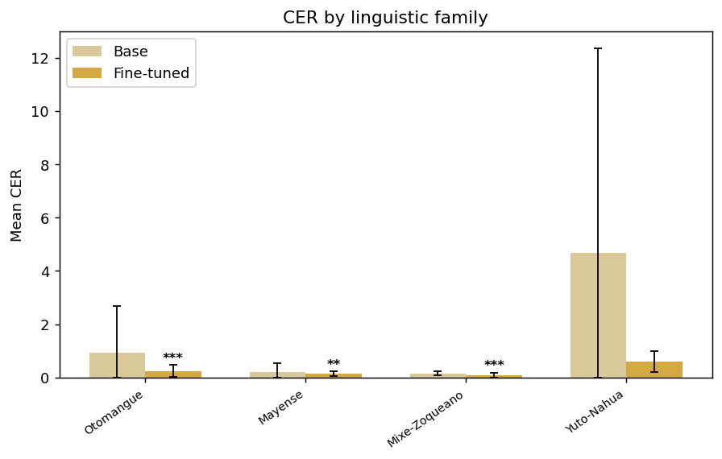

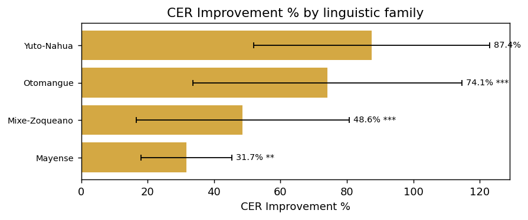

## By collection (n ≥ 3)

| collection    |   Pages |   Base CER |   Fine-tuned CER | CER Improvement   |   Base WER |   Fine-tuned WER |   Base Char Accuracy |   Fine-tuned Char Accuracy |   p-value | Significance   |
|:--------------|--------:|-----------:|-----------------:|:------------------|-----------:|-----------------:|---------------------:|---------------------------:|----------:|:---------------|
| dictionary    |     412 |     0.3108 |           0.1994 | 35.8%             |     0.5713 |           0.4689 |               0.7263 |                     0.8006 |   0       | ***            |
| grammar       |     329 |     0.7954 |           0.2028 | 74.5%             |     0.7194 |           0.4132 |               0.5846 |                     0.7994 |   0       | ***            |
| writing_rules |      25 |     0.8804 |           0.2466 | 72.0%             |     0.7796 |           0.3802 |               0.4841 |                     0.7553 |   0.00335 | **             |
| legal         |      12 |     0.1241 |           0.0316 | 74.6%             |     0.6203 |           0.2162 |               0.8759 |                     0.9684 |   0       | ***            |
| textbooks     |       4 |     0.4236 |           0.423  | 0.1%              |     0.8218 |           0.6736 |               0.5764 |                     0.577  |   0.98474 | ns             |
| covid         |       3 |     0.2831 |           0.2741 | 3.2%              |     0.3897 |           0.315  |               0.7169 |                     0.7259 |   0.65429 | ns             |
| audio_stories |       3 |     0.0701 |           0.0654 | 6.8%              |     0.1956 |           0.2017 |               0.9299 |                     0.9346 |   0.32438 | ns             |

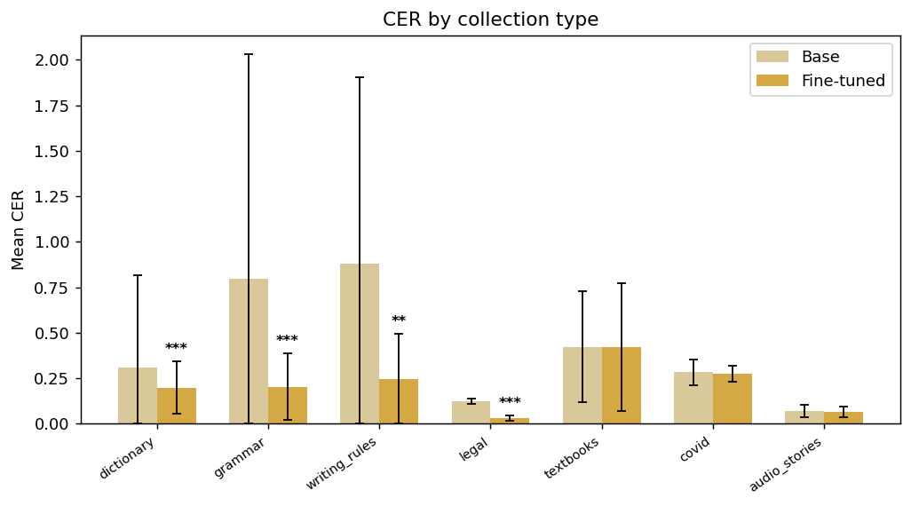

## By source (n ≥ 3)

| source     |   Pages |   Base CER |   Fine-tuned CER | CER Improvement   |   Base WER |   Fine-tuned WER |   Base Char Accuracy |   Fine-tuned Char Accuracy |   p-value | Significance   |
|:-----------|--------:|-----------:|-----------------:|:------------------|-----------:|-----------------:|---------------------:|---------------------------:|----------:|:---------------|
| ilv        |     943 |     0.7967 |           0.2283 | 71.3%             |     0.7646 |           0.4384 |               0.6138 |                     0.7798 |   0       | ***            |
| books      |      33 |     0.1308 |           0.0728 | 44.3%             |     0.335  |           0.2811 |               0.8692 |                     0.9272 |   0       | ***            |
| government |      12 |     0.1241 |           0.0316 | 74.6%             |     0.6203 |           0.2162 |               0.8759 |                     0.9684 |   0       | ***            |
| sep        |       4 |     0.4236 |           0.423  | 0.1%              |     0.8218 |           0.6736 |               0.5764 |                     0.577  |   0.98474 | ns             |
| ssa        |       3 |     0.2831 |           0.2741 | 3.2%              |     0.3897 |           0.315  |               0.7169 |                     0.7259 |   0.65429 | ns             |

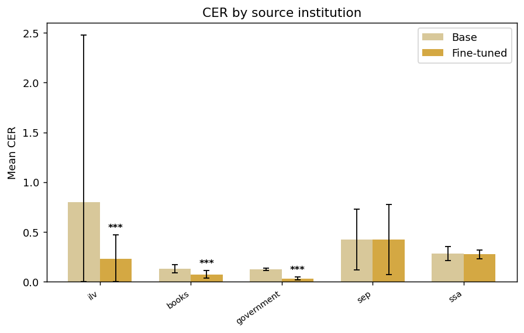

## By document (48 PDFs)

### amu gramatica

`3d6086b073801b95...`

| Field         | Value            |
|:--------------|:-----------------|
| name          | amu gramatica    |
| code          | amu              |
| language      | amuzgo del norte |
| superlanguage | Amuzgo           |
| family        | Otomangue        |
| collection    | grammar          |
| source        | ilv              |
| Pages         | 275              |

|   Base CER |   Fine-tuned CER | CER Improvement   |   Base WER |   Fine-tuned WER |   Base Char Accuracy |   Fine-tuned Char Accuracy |
|-----------:|-----------------:|:------------------|-----------:|-----------------:|---------------------:|---------------------------:|
|     0.7022 |           0.1837 | 73.8%             |     0.6758 |           0.3796 |               0.6023 |                     0.8189 |

### lac diccionario

`3a3e77f8a79843aa...`

| Field         | Value           |
|:--------------|:----------------|
| name          | lac diccionario |
| code          | lac             |
| language      | lacandón        |
| superlanguage | Lacandón        |
| family        | Mayense         |
| collection    | dictionary      |
| source        | ilv             |
| Pages         | 218             |

|   Base CER |   Fine-tuned CER | CER Improvement   |   Base WER |   Fine-tuned WER |   Base Char Accuracy |   Fine-tuned Char Accuracy |
|-----------:|-----------------:|:------------------|-----------:|-----------------:|---------------------:|---------------------------:|
|     0.2011 |           0.1373 | 31.7%             |     0.4191 |           0.3281 |               0.8178 |                     0.8627 |

### chz Diccionario chinanteco Ayotzintepec

`3821017ab1735512...`

| Field         | Value                                   |
|:--------------|:----------------------------------------|
| name          | chz Diccionario chinanteco Ayotzintepec |
| code          | chz                                     |
| language      | chinanteco del sureste alto             |
| superlanguage | Chinanteco                              |
| family        | Otomangue                               |
| collection    | dictionary                              |
| source        | ilv                                     |
| Pages         | 184                                     |

|   Base CER |   Fine-tuned CER | CER Improvement   |   Base WER |   Fine-tuned WER |   Base Char Accuracy |   Fine-tuned Char Accuracy |
|-----------:|-----------------:|:------------------|-----------:|-----------------:|---------------------:|---------------------------:|
|     0.4395 |           0.2672 | 39.2%             |     0.7536 |           0.6343 |               0.6211 |                     0.7328 |

### maj Tinchiyai

`2f22b175f84dfa92...`

| Field         | Value                  |
|:--------------|:-----------------------|
| name          | maj Tinchiyai          |
| code          | maj                    |
| language      | mazateco del este bajo |
| superlanguage | Mazateco               |
| family        | Otomangue              |
| source        | ilv                    |
| Pages         | 52                     |

|   Base CER |   Fine-tuned CER | CER Improvement   |   Base WER |   Fine-tuned WER |   Base Char Accuracy |   Fine-tuned Char Accuracy |
|-----------:|-----------------:|:------------------|-----------:|-----------------:|---------------------:|---------------------------:|
|     2.6131 |           0.2789 | 89.3%             |     1.2654 |           0.3337 |               0.3171 |                     0.7247 |

### zae gramatica

`095c6bea3354801c...`

| Field         | Value                             |
|:--------------|:----------------------------------|
| name          | zae gramatica                     |
| code          | zae                               |
| language      | zapoteco serrano, del oeste medio |
| superlanguage | Zapoteco                          |
| family        | Otomangue                         |
| collection    | grammar                           |
| source        | ilv                               |
| Pages         | 46                                |

|   Base CER |   Fine-tuned CER | CER Improvement   |   Base WER |   Fine-tuned WER |   Base Char Accuracy |   Fine-tuned Char Accuracy |
|-----------:|-----------------:|:------------------|-----------:|-----------------:|---------------------:|---------------------------:|
|     1.4471 |           0.3078 | 78.7%             |     1.0276 |           0.5992 |               0.4507 |                     0.6922 |

### amu ljo machee tito

`34245b2168a386da...`

| Field         | Value               |
|:--------------|:--------------------|
| name          | amu ljo machee tito |
| code          | amu                 |
| language      | amuzgo del norte    |
| superlanguage | Amuzgo              |
| family        | Otomangue           |
| source        | ilv                 |
| Pages         | 37                  |

|   Base CER |   Fine-tuned CER | CER Improvement   |   Base WER |   Fine-tuned WER |   Base Char Accuracy |   Fine-tuned Char Accuracy |
|-----------:|-----------------:|:------------------|-----------:|-----------------:|---------------------:|---------------------------:|
|     3.5421 |           0.4384 | 87.6%             |     2.2038 |           0.5546 |               0.1407 |                     0.5782 |

### vmp const cdmx

`6fe4c85920beb343...`

| Field         | Value                |
|:--------------|:---------------------|
| name          | vmp const cdmx       |
| code          | vmp                  |
| language      | mazateco del noreste |
| superlanguage | Mazateco             |
| family        | Otomangue            |
| source        | books                |
| Pages         | 33                   |

|   Base CER |   Fine-tuned CER | CER Improvement   |   Base WER |   Fine-tuned WER |   Base Char Accuracy |   Fine-tuned Char Accuracy |
|-----------:|-----------------:|:------------------|-----------:|-----------------:|---------------------:|---------------------------:|
|     0.1308 |           0.0728 | 44.3%             |      0.335 |           0.2811 |               0.8692 |                     0.9272 |

### xtn Como escribimos vol2

`27bfbeb48121e049...`

| Field         | Value                    |
|:--------------|:-------------------------|
| name          | xtn Como escribimos vol2 |
| code          | xtn                      |
| language      | mixteco del norte bajo   |
| superlanguage | Mixteco                  |
| family        | Otomangue                |
| source        | ilv                      |
| Pages         | 19                       |

|   Base CER |   Fine-tuned CER | CER Improvement   |   Base WER |   Fine-tuned WER |   Base Char Accuracy |   Fine-tuned Char Accuracy |
|-----------:|-----------------:|:------------------|-----------:|-----------------:|---------------------:|---------------------------:|
|     1.2372 |            0.252 | 79.6%             |     0.8232 |           0.4008 |               0.4384 |                      0.748 |

### zad Adivinanzas

`36455bcc9617625d...`

| Field   | Value           |
|:--------|:----------------|
| name    | zad Adivinanzas |
| code    | zad             |
| source  | ilv             |
| Pages   | 14              |

|   Base CER |   Fine-tuned CER | CER Improvement   |   Base WER |   Fine-tuned WER |   Base Char Accuracy |   Fine-tuned Char Accuracy |
|-----------:|-----------------:|:------------------|-----------:|-----------------:|---------------------:|---------------------------:|
|     0.7247 |           0.6656 | 8.2%              |     0.9248 |           0.8327 |               0.5755 |                     0.6289 |

### poi

`68668118d10d08c7...`

| Field         | Value                 |
|:--------------|:----------------------|
| name          | poi                   |
| code          | poi                   |
| language      | popoluca de la Sierra |
| superlanguage | Popoluca              |
| family        | Mixe-Zoqueano         |
| collection    | legal                 |
| source        | government            |
| Pages         | 12                    |

|   Base CER |   Fine-tuned CER | CER Improvement   |   Base WER |   Fine-tuned WER |   Base Char Accuracy |   Fine-tuned Char Accuracy |
|-----------:|-----------------:|:------------------|-----------:|-----------------:|---------------------:|---------------------------:|
|     0.1241 |           0.0316 | 74.6%             |     0.6203 |           0.2162 |               0.8759 |                     0.9684 |

### vmz Tiempo

`e4553310cc432185...`

| Field         | Value                 |
|:--------------|:----------------------|
| name          | vmz Tiempo            |
| code          | vmz                   |
| language      | mazateco del suroeste |
| superlanguage | Mazateco              |
| family        | Otomangue             |
| source        | ilv                   |
| Pages         | 12                    |

|   Base CER |   Fine-tuned CER | CER Improvement   |   Base WER |   Fine-tuned WER |   Base Char Accuracy |   Fine-tuned Char Accuracy |
|-----------:|-----------------:|:------------------|-----------:|-----------------:|---------------------:|---------------------------:|
|     0.1922 |           0.3525 | -83.4%            |     0.2744 |           0.3489 |               0.8078 |                      0.783 |

### zad Mi peque%C3%B1o diccionario ilustrado

`de6b84e9223cef4c...`

| Field      | Value                                     |
|:-----------|:------------------------------------------|
| name       | zad Mi peque%C3%B1o diccionario ilustrado |
| code       | zad                                       |
| collection | dictionary                                |
| source     | ilv                                       |
| Pages      | 8                                         |

|   Base CER |   Fine-tuned CER | CER Improvement   |   Base WER |   Fine-tuned WER |   Base Char Accuracy |   Fine-tuned Char Accuracy |
|-----------:|-----------------:|:------------------|-----------:|-----------------:|---------------------:|---------------------------:|
|     0.2644 |           0.2519 | 4.7%              |     0.5303 |           0.5036 |               0.7356 |                     0.7481 |

### meh palabras pronuncian aire saliendo nariz leer

`ed3d5f294fc37eff...`

| Field         | Value                                            |
|:--------------|:-------------------------------------------------|
| name          | meh palabras pronuncian aire saliendo nariz leer |
| code          | meh                                              |
| language      | mixteco del suroeste                             |
| superlanguage | Mixteco                                          |
| family        | Otomangue                                        |
| collection    | writing_rules                                    |
| source        | ilv                                              |
| Pages         | 7                                                |

|   Base CER |   Fine-tuned CER | CER Improvement   |   Base WER |   Fine-tuned WER |   Base Char Accuracy |   Fine-tuned Char Accuracy |
|-----------:|-----------------:|:------------------|-----------:|-----------------:|---------------------:|---------------------------:|
|     0.6117 |           0.4138 | 32.4%             |     0.7759 |           0.4238 |               0.5506 |                     0.5929 |

### mxb gramatica

`e77b53788fcb5df4...`

| Field         | Value                      |
|:--------------|:---------------------------|
| name          | mxb gramatica              |
| code          | mxb                        |
| language      | mixteco del noroeste medio |
| superlanguage | Mixteco                    |
| family        | Otomangue                  |
| collection    | grammar                    |
| source        | ilv                        |
| Pages         | 7                          |

|   Base CER |   Fine-tuned CER | CER Improvement   |   Base WER |   Fine-tuned WER |   Base Char Accuracy |   Fine-tuned Char Accuracy |
|-----------:|-----------------:|:------------------|-----------:|-----------------:|---------------------:|---------------------------:|
|     0.2717 |           0.2731 | -0.5%             |     0.4706 |           0.5243 |               0.7283 |                     0.7269 |

### zpf como mueve tierra

`cfc885bd45a69539...`

| Field         | Value                                    |
|:--------------|:-----------------------------------------|
| name          | zpf como mueve tierra                    |
| code          | zpf                                      |
| language      | zapoteco de Sierra sur, del noreste alto |
| superlanguage | Zapoteco                                 |
| family        | Otomangue                                |
| source        | ilv                                      |
| Pages         | 6                                        |

|   Base CER |   Fine-tuned CER | CER Improvement   |   Base WER |   Fine-tuned WER |   Base Char Accuracy |   Fine-tuned Char Accuracy |
|-----------:|-----------------:|:------------------|-----------:|-----------------:|---------------------:|---------------------------:|
|     0.7919 |           0.7526 | 5.0%              |     0.4295 |           0.2596 |               0.2725 |                     0.3042 |

### meh gato

`7271ff9181682598...`

| Field         | Value                |
|:--------------|:---------------------|
| name          | meh gato             |
| code          | meh                  |
| language      | mixteco del suroeste |
| superlanguage | Mixteco              |
| family        | Otomangue            |
| source        | ilv                  |
| Pages         | 5                    |

|   Base CER |   Fine-tuned CER | CER Improvement   |   Base WER |   Fine-tuned WER |   Base Char Accuracy |   Fine-tuned Char Accuracy |
|-----------:|-----------------:|:------------------|-----------:|-----------------:|---------------------:|---------------------------:|
|     0.1739 |            0.028 | 83.9%             |     0.4416 |           0.0841 |               0.8261 |                      0.972 |

### mim convOrt

`46732de90223332b...`

| Field         | Value                       |
|:--------------|:----------------------------|
| name          | mim convOrt                 |
| code          | mim                         |
| language      | mixteco central de Guerrero |
| superlanguage | Mixteco                     |
| family        | Otomangue                   |
| collection    | writing_rules               |
| source        | ilv                         |
| Pages         | 5                           |

|   Base CER |   Fine-tuned CER | CER Improvement   |   Base WER |   Fine-tuned WER |   Base Char Accuracy |   Fine-tuned Char Accuracy |
|-----------:|-----------------:|:------------------|-----------:|-----------------:|---------------------:|---------------------------:|
|     0.6017 |           0.1092 | 81.9%             |     0.4328 |           0.1703 |               0.5719 |                     0.8908 |

### zca para gente coatecas altas

`19185af8e6fa6426...`

| Field         | Value                         |
|:--------------|:------------------------------|
| name          | zca para gente coatecas altas |
| code          | zca                           |
| language      | zapoteco de Valles del sur    |
| superlanguage | Zapoteco                      |
| family        | Otomangue                     |
| source        | ilv                           |
| Pages         | 4                             |

|   Base CER |   Fine-tuned CER | CER Improvement   |   Base WER |   Fine-tuned WER |   Base Char Accuracy |   Fine-tuned Char Accuracy |
|-----------:|-----------------:|:------------------|-----------:|-----------------:|---------------------:|---------------------------:|
|     0.1042 |           0.0098 | 90.6%             |     0.4283 |           0.0292 |               0.8958 |                     0.9902 |

### ztg siembra milpa

`9a69b11b32d0a11a...`

| Field         | Value                                       |
|:--------------|:--------------------------------------------|
| name          | ztg siembra milpa                           |
| code          | ztg                                         |
| language      | zapoteco de la Sierra sur, del sureste alto |
| superlanguage | Zapoteco                                    |
| family        | Otomangue                                   |
| source        | ilv                                         |
| Pages         | 4                                           |

|   Base CER |   Fine-tuned CER | CER Improvement   |   Base WER |   Fine-tuned WER |   Base Char Accuracy |   Fine-tuned Char Accuracy |
|-----------:|-----------------:|:------------------|-----------:|-----------------:|---------------------:|---------------------------:|
|      0.284 |           0.0575 | 79.8%             |     0.4544 |           0.1624 |                0.716 |                     0.9425 |

### jau jm kie jé jeu jëi

`ec2506ab3f4217eb...`

| Field         | Value                             |
|:--------------|:----------------------------------|
| name          | jau jm kie jé jeu jëi             |
| code          | cuc                               |
| language      | chinanteco del oeste central alto |
| superlanguage | Chinanteco                        |
| family        | Otomangue                         |
| collection    | textbooks                         |
| source        | sep                               |
| Pages         | 4                                 |

|   Base CER |   Fine-tuned CER | CER Improvement   |   Base WER |   Fine-tuned WER |   Base Char Accuracy |   Fine-tuned Char Accuracy |
|-----------:|-----------------:|:------------------|-----------:|-----------------:|---------------------:|---------------------------:|
|     0.4236 |            0.423 | 0.1%              |     0.8218 |           0.6736 |               0.5764 |                      0.577 |

### zpc ConvOrth

`e9fddd9c8047918c...`

| Field         | Value                          |
|:--------------|:-------------------------------|
| name          | zpc ConvOrth                   |
| code          | zpc                            |
| language      | zapoteco del oeste de Tuxtepec |
| superlanguage | Zapoteco                       |
| family        | Otomangue                      |
| collection    | writing_rules                  |
| source        | ilv                            |
| Pages         | 4                              |

|   Base CER |   Fine-tuned CER | CER Improvement   |   Base WER |   Fine-tuned WER |   Base Char Accuracy |   Fine-tuned Char Accuracy |
|-----------:|-----------------:|:------------------|-----------:|-----------------:|---------------------:|---------------------------:|
|      1.465 |           0.1784 | 87.8%             |     1.2348 |           0.4672 |               0.4288 |                     0.8216 |

### maa propuesta escribir eloxochitlan

`ea3037cbf633149a...`

| Field         | Value                               |
|:--------------|:------------------------------------|
| name          | maa propuesta escribir eloxochitlan |
| code          | maa                                 |
| language      | mazateco de Tecóatl                 |
| superlanguage | Mazateco                            |
| family        | Otomangue                           |
| collection    | writing_rules                       |
| source        | ilv                                 |
| Pages         | 3                                   |

|   Base CER |   Fine-tuned CER | CER Improvement   |   Base WER |   Fine-tuned WER |   Base Char Accuracy |   Fine-tuned Char Accuracy |
|-----------:|-----------------:|:------------------|-----------:|-----------------:|---------------------:|---------------------------:|
|     1.4269 |           0.2046 | 85.7%             |     0.9245 |           0.3769 |               0.1063 |                     0.7954 |

### cle propusta convenciones escribir

`5a8c538b77121131...`

| Field         | Value                              |
|:--------------|:-----------------------------------|
| name          | cle propusta convenciones escribir |
| code          | cle                                |
| language      | chinanteco central                 |
| superlanguage | Chinanteco                         |
| family        | Otomangue                          |
| collection    | writing_rules                      |
| source        | ilv                                |
| Pages         | 3                                  |

|   Base CER |   Fine-tuned CER | CER Improvement   |   Base WER |   Fine-tuned WER |   Base Char Accuracy |   Fine-tuned Char Accuracy |
|-----------:|-----------------:|:------------------|-----------:|-----------------:|---------------------:|---------------------------:|
|     0.8594 |           0.0971 | 88.7%             |     0.7045 |           0.2619 |               0.5834 |                     0.9029 |

### jmx construir casas adobe

`7a41e4090bed3bf0...`

| Field         | Value                     |
|:--------------|:--------------------------|
| name          | jmx construir casas adobe |
| code          | jmx                       |
| language      | mixteco del oeste         |
| superlanguage | Mixteco                   |
| family        | Otomangue                 |
| source        | ilv                       |
| Pages         | 3                         |

|   Base CER |   Fine-tuned CER | CER Improvement   |   Base WER |   Fine-tuned WER |   Base Char Accuracy |   Fine-tuned Char Accuracy |
|-----------:|-----------------:|:------------------|-----------:|-----------------:|---------------------:|---------------------------:|
|     0.3156 |           0.2556 | 19.0%             |     0.5993 |            0.554 |               0.6844 |                     0.7444 |

### popoluca-de-la-sierra-guia-atencion-pueblos-indigenas-afrome

`a241ac3dbdebe054...`

| Field         | Value                                                                      |
|:--------------|:---------------------------------------------------------------------------|
| name          | popoluca-de-la-sierra-guia-atencion-pueblos-indigenas-afromexicano-covid19 |
| code          | poi                                                                        |
| language      | popoluca de la Sierra                                                      |
| superlanguage | Popoluca                                                                   |
| family        | Mixe-Zoqueano                                                              |
| collection    | covid                                                                      |
| source        | ssa                                                                        |
| Pages         | 3                                                                          |

|   Base CER |   Fine-tuned CER | CER Improvement   |   Base WER |   Fine-tuned WER |   Base Char Accuracy |   Fine-tuned Char Accuracy |
|-----------:|-----------------:|:------------------|-----------:|-----------------:|---------------------:|---------------------------:|
|     0.2831 |           0.2741 | 3.2%              |     0.3897 |            0.315 |               0.7169 |                     0.7259 |

### zaw juan el carbonero

`22f280a28bcd8ac3...`

| Field         | Value                              |
|:--------------|:-----------------------------------|
| name          | zaw juan el carbonero              |
| code          | zaw                                |
| language      | zapoteco de Valles, del este medio |
| superlanguage | Zapoteco                           |
| family        | Otomangue                          |
| source        | ilv                                |
| Pages         | 2                                  |

|   Base CER |   Fine-tuned CER | CER Improvement   |   Base WER |   Fine-tuned WER |   Base Char Accuracy |   Fine-tuned Char Accuracy |
|-----------:|-----------------:|:------------------|-----------:|-----------------:|---------------------:|---------------------------:|
|     0.0817 |           0.0379 | 53.6%             |     0.4132 |            0.216 |               0.9183 |                     0.9621 |

### documento 4

`b9503fb0bef280cf...`

| Field      | Value       |
|:-----------|:------------|
| name       | documento 4 |
| collection | academic    |
| Pages      | 2           |

|   Base CER |   Fine-tuned CER | CER Improvement   |   Base WER |   Fine-tuned WER |   Base Char Accuracy |   Fine-tuned Char Accuracy |
|-----------:|-----------------:|:------------------|-----------:|-----------------:|---------------------:|---------------------------:|
|     0.0616 |            0.068 | -10.3%            |     0.2099 |           0.2301 |               0.9384 |                      0.932 |

### Mi mama Otomi

`dc962399cb712adf...`

| Field         | Value                         |
|:--------------|:------------------------------|
| name          | Mi mama Otomi                 |
| code          | ote                           |
| language      | otomí del Valle del Mezquital |
| superlanguage | Otomí                         |
| family        | Otomangue                     |
| collection    | audio_stories                 |
| Pages         | 2                             |

|   Base CER |   Fine-tuned CER | CER Improvement   |   Base WER |   Fine-tuned WER |   Base Char Accuracy |   Fine-tuned Char Accuracy |
|-----------:|-----------------:|:------------------|-----------:|-----------------:|---------------------:|---------------------------:|
|     0.0506 |           0.0495 | 2.2%              |     0.1631 |           0.1837 |               0.9494 |                     0.9504 |

### ztg varios tipos salsas

`fd5319d4c7d3975d...`

| Field         | Value                                       |
|:--------------|:--------------------------------------------|
| name          | ztg varios tipos salsas                     |
| code          | ztg                                         |
| language      | zapoteco de la Sierra sur, del sureste alto |
| superlanguage | Zapoteco                                    |
| family        | Otomangue                                   |
| source        | ilv                                         |
| Pages         | 2                                           |

|   Base CER |   Fine-tuned CER | CER Improvement   |   Base WER |   Fine-tuned WER |   Base Char Accuracy |   Fine-tuned Char Accuracy |
|-----------:|-----------------:|:------------------|-----------:|-----------------:|---------------------:|---------------------------:|
|     0.2363 |            0.152 | 35.7%             |     0.6814 |           0.6026 |               0.7637 |                      0.848 |

### zca benito juarez

`3bdde4164c4c074a...`

| Field         | Value                      |
|:--------------|:---------------------------|
| name          | zca benito juarez          |
| code          | zca                        |
| language      | zapoteco de Valles del sur |
| superlanguage | Zapoteco                   |
| family        | Otomangue                  |
| source        | ilv                        |
| Pages         | 2                          |

|   Base CER |   Fine-tuned CER | CER Improvement   |   Base WER |   Fine-tuned WER |   Base Char Accuracy |   Fine-tuned Char Accuracy |
|-----------:|-----------------:|:------------------|-----------:|-----------------:|---------------------:|---------------------------:|
|     0.6448 |           0.6106 | 5.3%              |     0.5234 |           0.3658 |               0.3552 |                     0.3894 |

### ztg no hay comer

`7c50115f3dd6def7...`

| Field         | Value                                       |
|:--------------|:--------------------------------------------|
| name          | ztg no hay comer                            |
| code          | ztg                                         |
| language      | zapoteco de la Sierra sur, del sureste alto |
| superlanguage | Zapoteco                                    |
| family        | Otomangue                                   |
| source        | ilv                                         |
| Pages         | 2                                           |

|   Base CER |   Fine-tuned CER | CER Improvement   |   Base WER |   Fine-tuned WER |   Base Char Accuracy |   Fine-tuned Char Accuracy |
|-----------:|-----------------:|:------------------|-----------:|-----------------:|---------------------:|---------------------------:|
|      0.279 |           0.0485 | 82.6%             |     0.4786 |           0.1612 |                0.721 |                     0.9515 |

### nhx 23e Fonemas nhx

`0c4f343b8bdd326f...`

| Field         | Value               |
|:--------------|:--------------------|
| name          | nhx 23e Fonemas nhx |
| code          | nhx                 |
| language      | náhuatl del Istmo   |
| superlanguage | Náhuatl             |
| family        | Yuto-Nahua          |
| source        | ilv                 |
| Pages         | 2                   |

|   Base CER |   Fine-tuned CER | CER Improvement   |   Base WER |   Fine-tuned WER |   Base Char Accuracy |   Fine-tuned Char Accuracy |
|-----------:|-----------------:|:------------------|-----------:|-----------------:|---------------------:|---------------------------:|
|     0.4992 |           0.2997 | 40.0%             |     0.4838 |           0.4459 |               0.5008 |                     0.7003 |

### mix parangon

`ea546774e6a90ef4...`

| Field         | Value           |
|:--------------|:----------------|
| name          | mix parangon    |
| code          | mix             |
| language      | mixteco de Ñumi |
| superlanguage | Mixteco         |
| family        | Otomangue       |
| source        | ilv             |
| Pages         | 2               |

|   Base CER |   Fine-tuned CER | CER Improvement   |   Base WER |   Fine-tuned WER |   Base Char Accuracy |   Fine-tuned Char Accuracy |
|-----------:|-----------------:|:------------------|-----------:|-----------------:|---------------------:|---------------------------:|
|     1.8825 |           0.5226 | 72.2%             |     1.1325 |           0.5575 |               0.4069 |                     0.4774 |

### mib LeerMixteco

`840d1c3e70dda466...`

| Field   | Value           |
|:--------|:----------------|
| name    | mib LeerMixteco |
| code    | mib             |
| source  | ilv             |
| Pages   | 2               |

|   Base CER |   Fine-tuned CER | CER Improvement   |   Base WER |   Fine-tuned WER |   Base Char Accuracy |   Fine-tuned Char Accuracy |
|-----------:|-----------------:|:------------------|-----------:|-----------------:|---------------------:|---------------------------:|
|     2.0158 |           0.2197 | 89.1%             |     1.1836 |           0.2512 |               0.4565 |                     0.7803 |

### mix aves

`2b3e63ae5fc1805a...`

| Field         | Value           |
|:--------------|:----------------|
| name          | mix aves        |
| code          | mix             |
| language      | mixteco de Ñumi |
| superlanguage | Mixteco         |
| family        | Otomangue       |
| collection    | dictionary      |
| source        | ilv             |
| Pages         | 1               |

|   Base CER |   Fine-tuned CER | CER Improvement   |   Base WER |   Fine-tuned WER |   Base Char Accuracy |   Fine-tuned Char Accuracy |
|-----------:|-----------------:|:------------------|-----------:|-----------------:|---------------------:|---------------------------:|
|      0.718 |           0.5676 | 20.9%             |     0.4946 |           0.4731 |                0.282 |                     0.4324 |

### Que cosa mas rara Otomi

`2bc96a19bef976cf...`

| Field         | Value                         |
|:--------------|:------------------------------|
| name          | Que cosa mas rara Otomi       |
| code          | ote                           |
| language      | otomí del Valle del Mezquital |
| superlanguage | Otomí                         |
| family        | Otomangue                     |
| collection    | audio_stories                 |
| Pages         | 1                             |

|   Base CER |   Fine-tuned CER | CER Improvement   |   Base WER |   Fine-tuned WER |   Base Char Accuracy |   Fine-tuned Char Accuracy |
|-----------:|-----------------:|:------------------|-----------:|-----------------:|---------------------:|---------------------------:|
|     0.1091 |            0.097 | 11.1%             |     0.2607 |           0.2376 |               0.8909 |                      0.903 |

### xtn GramPopular

`187fe1ca20a09c8e...`

| Field         | Value                  |
|:--------------|:-----------------------|
| name          | xtn GramPopular        |
| code          | xtn                    |
| language      | mixteco del norte bajo |
| superlanguage | Mixteco                |
| family        | Otomangue              |
| collection    | grammar                |
| source        | ilv                    |
| Pages         | 1                      |

|   Base CER |   Fine-tuned CER | CER Improvement   |   Base WER |   Fine-tuned WER |   Base Char Accuracy |   Fine-tuned Char Accuracy |
|-----------:|-----------------:|:------------------|-----------:|-----------------:|---------------------:|---------------------------:|
|     0.1167 |            0.125 | -7.1%             |     0.2824 |           0.3341 |               0.8833 |                      0.875 |

### mza Alfabeto en mixteco

`10f40f5d54899d59...`

| Field         | Value                       |
|:--------------|:----------------------------|
| name          | mza Alfabeto en mixteco     |
| code          | mza                         |
| language      | mixteco de Sierra sur oeste |
| superlanguage | Mixteco                     |
| family        | Otomangue                   |
| collection    | writing_rules               |
| source        | ilv                         |
| Pages         | 1                           |

|   Base CER |   Fine-tuned CER | CER Improvement   |   Base WER |   Fine-tuned WER |   Base Char Accuracy |   Fine-tuned Char Accuracy |
|-----------:|-----------------:|:------------------|-----------:|-----------------:|---------------------:|---------------------------:|
|     0.3253 |           0.2651 | 18.5%             |     0.9167 |           0.8333 |               0.6747 |                     0.7349 |

### zpt diccionario ilustrado

`18ad1681fa9da635...`

| Field         | Value                           |
|:--------------|:--------------------------------|
| name          | zpt diccionario ilustrado       |
| code          | zpt                             |
| language      | zapoteco de San Vicente Coatlán |
| superlanguage | Zapoteco                        |
| family        | Otomangue                       |
| collection    | dictionary                      |
| source        | ilv                             |
| Pages         | 1                               |

|   Base CER |   Fine-tuned CER | CER Improvement   |   Base WER |   Fine-tuned WER |   Base Char Accuracy |   Fine-tuned Char Accuracy |
|-----------:|-----------------:|:------------------|-----------:|-----------------:|---------------------:|---------------------------:|
|     0.5067 |           0.4704 | 7.2%              |     0.6083 |             0.45 |               0.4933 |                     0.5296 |

### vmj Sikiyo

`27aa69f65c2536c8...`

| Field         | Value                |
|:--------------|:---------------------|
| name          | vmj Sikiyo           |
| code          | vmj                  |
| language      | mixteco de Ixtayutla |
| superlanguage | Mixteco              |
| family        | Otomangue            |
| source        | ilv                  |
| Pages         | 1                    |

|   Base CER |   Fine-tuned CER | CER Improvement   |   Base WER |   Fine-tuned WER |   Base Char Accuracy |   Fine-tuned Char Accuracy |
|-----------:|-----------------:|:------------------|-----------:|-----------------:|---------------------:|---------------------------:|
|     0.1447 |           0.0881 | 39.1%             |     0.3235 |           0.2353 |               0.8553 |                     0.9119 |

### ztg casaban antes leer

`314a94bf51a251eb...`

| Field         | Value                                       |
|:--------------|:--------------------------------------------|
| name          | ztg casaban antes leer                      |
| code          | ztg                                         |
| language      | zapoteco de la Sierra sur, del sureste alto |
| superlanguage | Zapoteco                                    |
| family        | Otomangue                                   |
| source        | ilv                                         |
| Pages         | 1                                           |

|   Base CER |   Fine-tuned CER | CER Improvement   |   Base WER |   Fine-tuned WER |   Base Char Accuracy |   Fine-tuned Char Accuracy |
|-----------:|-----------------:|:------------------|-----------:|-----------------:|---------------------:|---------------------------:|
|     0.1203 |            0.038 | 68.4%             |        0.5 |           0.1071 |               0.8797 |                      0.962 |

### meh pato

`9246e28741d3c23b...`

| Field         | Value                |
|:--------------|:---------------------|
| name          | meh pato             |
| code          | meh                  |
| language      | mixteco del suroeste |
| superlanguage | Mixteco              |
| family        | Otomangue            |
| source        | ilv                  |
| Pages         | 1                    |

|   Base CER |   Fine-tuned CER | CER Improvement   |   Base WER |   Fine-tuned WER |   Base Char Accuracy |   Fine-tuned Char Accuracy |
|-----------:|-----------------:|:------------------|-----------:|-----------------:|---------------------:|---------------------------:|
|     0.0973 |           0.0302 | 69.0%             |     0.2692 |           0.1731 |               0.9027 |                     0.9698 |

### ztg algunas cosas

`87f2abb607c5f71c...`

| Field         | Value                                       |
|:--------------|:--------------------------------------------|
| name          | ztg algunas cosas                           |
| code          | ztg                                         |
| language      | zapoteco de la Sierra sur, del sureste alto |
| superlanguage | Zapoteco                                    |
| family        | Otomangue                                   |
| source        | ilv                                         |
| Pages         | 1                                           |

|   Base CER |   Fine-tuned CER | CER Improvement   |   Base WER |   Fine-tuned WER |   Base Char Accuracy |   Fine-tuned Char Accuracy |
|-----------:|-----------------:|:------------------|-----------:|-----------------:|---------------------:|---------------------------:|
|     0.1715 |           0.0803 | 53.2%             |     0.3556 |           0.2444 |               0.8285 |                     0.9197 |

### hch escribiendo

`48e87dbd21e07219...`

| Field         | Value             |
|:--------------|:------------------|
| name          | hch escribiendo   |
| code          | hch               |
| language      | huichol del norte |
| superlanguage | Huichol           |
| family        | Yuto-Nahua        |
| collection    | writing_rules     |
| source        | ilv               |
| Pages         | 1                 |

|   Base CER |   Fine-tuned CER | CER Improvement   |   Base WER |   Fine-tuned WER |   Base Char Accuracy |   Fine-tuned Char Accuracy |
|-----------:|-----------------:|:------------------|-----------:|-----------------:|---------------------:|---------------------------:|
|      1.605 |           0.7636 | 52.4%             |     0.9604 |           0.8812 |                    0 |                     0.2364 |

### zpg contemos animalitos numeros

`4273051baa954c86...`

| Field         | Value                                  |
|:--------------|:---------------------------------------|
| name          | zpg contemos animalitos numeros        |
| code          | zpg                                    |
| language      | zapoteco de la montaña del Istmo, bajo |
| superlanguage | Zapoteco                               |
| family        | Otomangue                              |
| source        | ilv                                    |
| Pages         | 1                                      |

|   Base CER |   Fine-tuned CER | CER Improvement   |   Base WER |   Fine-tuned WER |   Base Char Accuracy |   Fine-tuned Char Accuracy |
|-----------:|-----------------:|:------------------|-----------:|-----------------:|---------------------:|---------------------------:|
|     0.5195 |           0.5073 | 2.3%              |     2.0417 |           1.9583 |               0.4805 |                     0.4927 |

### sei ConvOrt 2019

`90ebd33c069d49c4...`

| Field         | Value            |
|:--------------|:-----------------|
| name          | sei ConvOrt 2019 |
| code          | sei              |
| language      | seri             |
| superlanguage | Seri             |
| family        | Seri             |
| collection    | writing_rules    |
| source        | ilv              |
| Pages         | 1                |

|   Base CER |   Fine-tuned CER | CER Improvement   |   Base WER |   Fine-tuned WER |   Base Char Accuracy |   Fine-tuned Char Accuracy |
|-----------:|-----------------:|:------------------|-----------:|-----------------:|---------------------:|---------------------------:|
|     0.0712 |           0.0757 | -6.3%             |     0.1905 |            0.188 |               0.9288 |                     0.9243 |

### zca labores mujeres coatecas altas

`99814cfac40bd9a3...`

| Field         | Value                              |
|:--------------|:-----------------------------------|
| name          | zca labores mujeres coatecas altas |
| code          | zca                                |
| language      | zapoteco de Valles del sur         |
| superlanguage | Zapoteco                           |
| family        | Otomangue                          |
| collection    | rights                             |
| source        | ilv                                |
| Pages         | 1                                  |

|   Base CER |   Fine-tuned CER | CER Improvement   |   Base WER |   Fine-tuned WER |   Base Char Accuracy |   Fine-tuned Char Accuracy |
|-----------:|-----------------:|:------------------|-----------:|-----------------:|---------------------:|---------------------------:|
|     0.0708 |           0.0181 | 74.4%             |     0.3219 |           0.0753 |               0.9292 |                     0.9819 |

### hch silabas

`e7a661bb0627c9e2...`

| Field         | Value             |
|:--------------|:------------------|
| name          | hch silabas       |
| code          | hch               |
| language      | huichol del norte |
| superlanguage | Huichol           |
| family        | Yuto-Nahua        |
| source        | ilv               |
| Pages         | 1                 |

|   Base CER |   Fine-tuned CER | CER Improvement   |   Base WER |   Fine-tuned WER |   Base Char Accuracy |   Fine-tuned Char Accuracy |
|-----------:|-----------------:|:------------------|-----------:|-----------------:|---------------------:|---------------------------:|
|    16.1618 |                1 | 93.8%             |    26.5333 |                1 |                    0 |                          0 |
