# Tachiwin-OCR-1.5 Evaluation Report

2000-page benchmark · uncommon_char_score ≥ 0.3  |  Run: 2026-07-18 01:15:42 · challenging-3-2000

**Base model:** [PaddleOCR-VL-1.5](https://huggingface.co/PaddlePaddle/PaddleOCR-VL-1.5)  ·  **Fine-tuned model:** [Tachiwin-OCR-1.5](https://huggingface.co/tachiwin/Tachiwin-OCR-1.5)

Significance (paired t-test, base CER vs fine-tuned CER within group): *** p<0.001  ** p<0.01  * p<0.05  ns=not significant

Overall: base CER 0.7729 → ft CER 0.2323 (−29.3% relative)

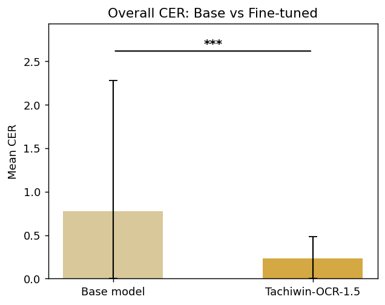

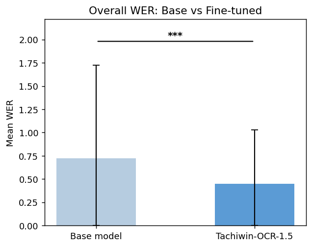

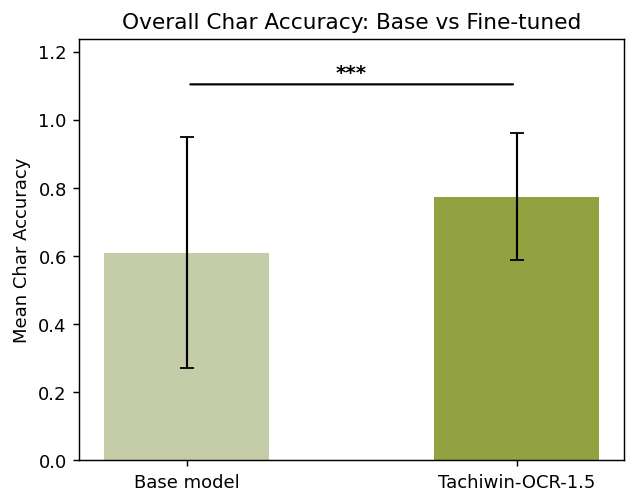

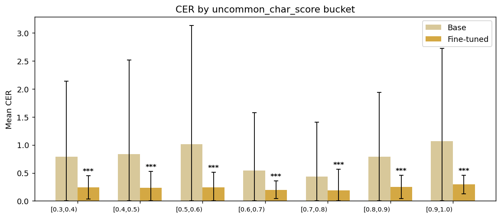

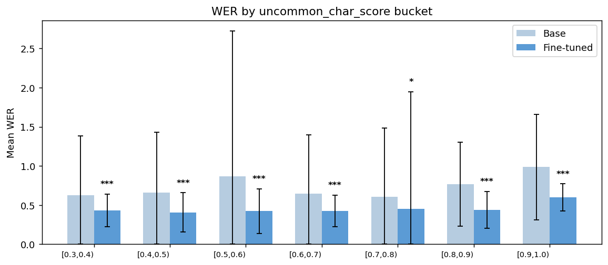

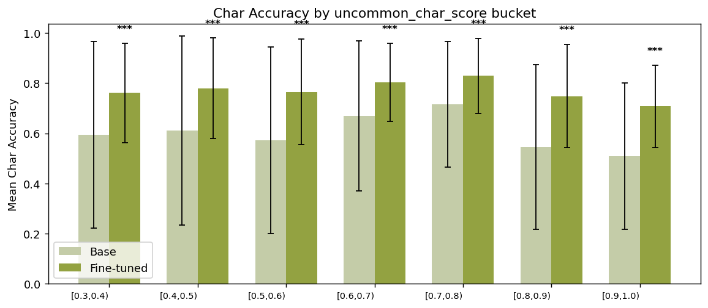

## By uncommon_char_score bucket

| Score range   |   Pages |   Base CER |   Fine-tuned CER | CER Improvement   |   Base WER |   Fine-tuned WER |   Base Char Accuracy |   Fine-tuned Char Accuracy |   p-value | Significance   |
|:--------------|--------:|-----------:|-----------------:|:------------------|-----------:|-----------------:|---------------------:|---------------------------:|----------:|:---------------|
| [0.3, 0.4)    |     351 |     0.7925 |           0.2414 | 69.5%             |     0.6282 |           0.4337 |               0.594  |                     0.7609 |         0 | ***            |
| [0.4, 0.5)    |     316 |     0.8332 |           0.2352 | 71.8%             |     0.6575 |           0.4064 |               0.6111 |                     0.7795 |         0 | ***            |
| [0.5, 0.6)    |     280 |     1.0101 |           0.2446 | 75.8%             |     0.868  |           0.4227 |               0.5715 |                     0.7654 |         0 | ***            |
| [0.6, 0.7)    |     424 |     0.5425 |           0.1981 | 63.5%             |     0.6427 |           0.423  |               0.6703 |                     0.8023 |         0 | ***            |
| [0.7, 0.8)    |     260 |     0.433  |           0.1896 | 56.2%             |     0.608  |           0.4532 |               0.7153 |                     0.8289 |         0 | ***            |
| [0.8, 0.9)    |     106 |     0.7862 |           0.252  | 67.9%             |     0.7676 |           0.4401 |               0.5462 |                     0.7484 |         0 | ***            |
| [0.9, 1.0)    |     242 |     1.0649 |           0.2922 | 72.6%             |     0.9865 |           0.5971 |               0.5081 |                     0.7078 |         0 | ***            |

## By code (n ≥ 3)

| code   |   Pages |   Base CER |   Fine-tuned CER | CER Improvement   |   Base WER |   Fine-tuned WER |   Base Char Accuracy |   Fine-tuned Char Accuracy |   p-value | Significance   |
|:-------|--------:|-----------:|-----------------:|:------------------|-----------:|-----------------:|---------------------:|---------------------------:|----------:|:---------------|
| lac    |     431 |     0.3215 |           0.2004 | 37.7%             |     0.5292 |           0.4381 |               0.7284 |                     0.7996 |   0       | ***            |
| amu    |     328 |     1.0539 |           0.2185 | 79.3%             |     0.8684 |           0.4006 |               0.5378 |                     0.7855 |   0       | ***            |
| cco    |     217 |     1.584  |           0.3245 | 79.5%             |     1.1364 |           0.5833 |               0.4001 |                     0.6975 |   0       | ***            |
| chz    |     187 |     0.4394 |           0.2643 | 39.8%             |     0.7473 |           0.6277 |               0.6212 |                     0.7357 |   4e-05   | ***            |
| zae    |     165 |     1.1786 |           0.2814 | 76.1%             |     0.8281 |           0.5564 |               0.4936 |                     0.7186 |   0       | ***            |
| otm    |     146 |     0.3397 |           0.1432 | 57.8%             |     0.4422 |           0.3171 |               0.7337 |                     0.8568 |   2e-05   | ***            |
| zpl    |      76 |     0.3797 |           0.1904 | 49.8%             |     0.4155 |           0.4257 |               0.7487 |                     0.8096 |   0.01852 | *              |
| maj    |      64 |     2.5339 |           0.2823 | 88.9%             |     1.2113 |           0.3323 |               0.3097 |                     0.7206 |   0       | ***            |
| mxb    |      50 |     0.3616 |           0.211  | 41.7%             |     0.5372 |           0.4413 |               0.7348 |                     0.789  |   0.08147 | ns             |
| ote    |      42 |     0.2417 |           0.2053 | 15.1%             |     0.4134 |           0.4206 |               0.7724 |                     0.7947 |   0.26983 | ns             |
| ztg    |      42 |     0.2374 |           0.1253 | 47.2%             |     0.4984 |           0.286  |               0.7626 |                     0.8747 |   0       | ***            |
| vmp    |      33 |     0.1308 |           0.0728 | 44.3%             |     0.3352 |           0.2811 |               0.8692 |                     0.9272 |   0       | ***            |
| xtn    |      32 |     1.2008 |           0.1962 | 83.7%             |     0.7399 |           0.3355 |               0.4192 |                     0.8038 |   0.00017 | ***            |
| jmx    |      22 |     0.4976 |           0.0884 | 82.2%             |     0.5324 |           0.2429 |               0.6829 |                     0.9116 |   0.03762 | *              |
| zad    |      22 |     0.5573 |           0.5152 | 7.6%              |     0.7813 |           0.7133 |               0.6337 |                     0.6723 |   0.06089 | ns             |
| meh    |      20 |     0.4454 |           0.2521 | 43.4%             |     0.6253 |           0.335  |               0.6119 |                     0.7502 |   0.02405 | *              |
| vmz    |      17 |     0.3147 |           0.304  | 3.4%              |     0.3315 |           0.3137 |               0.7777 |                     0.7916 |   0.95186 | ns             |
| poi    |      16 |     0.1489 |           0.0766 | 48.5%             |     0.5453 |           0.2266 |               0.8511 |                     0.9234 |   0       | ***            |
| mix    |      11 |     0.7182 |           0.4871 | 32.2%             |     0.5616 |           0.5226 |               0.5162 |                     0.5129 |   0.37982 | ns             |
| zpf    |       9 |     0.9057 |           0.8709 | 3.8%              |     0.4417 |           0.2924 |               0.2317 |                     0.2562 |   0       | ***            |
| zca    |       9 |     0.2136 |           0.1539 | 27.9%             |     0.4032 |           0.1458 |               0.7864 |                     0.8461 |   0.00161 | **             |
| mim    |       6 |     0.8157 |           0.1286 | 84.2%             |     0.538  |           0.1791 |               0.4766 |                     0.8714 |   0.07934 | ns             |
| zaw    |       6 |     1.2497 |           0.19   | 84.8%             |     1.4656 |           0.2731 |               0.7604 |                     0.81   |   0.34645 | ns             |
| zpc    |       5 |     1.1948 |           0.1638 | 86.3%             |     1.043  |           0.4311 |               0.5202 |                     0.8362 |   0.22622 | ns             |
| mib    |       5 |     1.7794 |           0.2591 | 85.4%             |     0.9562 |           0.2786 |               0.3467 |                     0.7409 |   0.08299 | ns             |
| cle    |       4 |     1.1483 |           0.2208 | 80.8%             |     0.8331 |           0.3423 |               0.4376 |                     0.7792 |   0.17294 | ns             |
| zpt    |       4 |     0.3168 |           0.2198 | 30.6%             |     0.496  |           0.3828 |               0.6832 |                     0.7802 |   0.27705 | ns             |
| cuc    |       4 |     0.4236 |           0.423  | 0.1%              |     0.8218 |           0.6736 |               0.5764 |                     0.577  |   0.98474 | ns             |
| maa    |       3 |     1.4269 |           0.2046 | 85.7%             |     0.9245 |           0.3769 |               0.1063 |                     0.7954 |   0.17    | ns             |
| vmj    |       3 |     0.3408 |           0.3105 | 8.9%              |     0.5559 |           0.5265 |               0.6592 |                     0.6895 |   0.18106 | ns             |

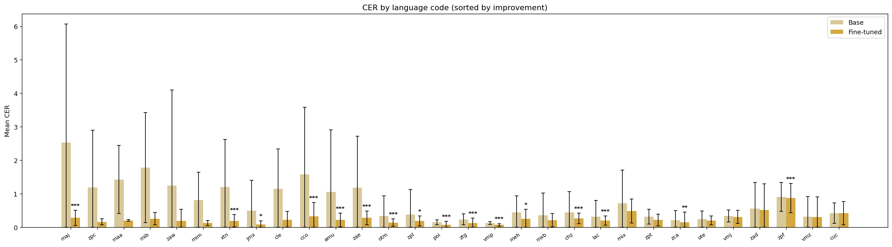

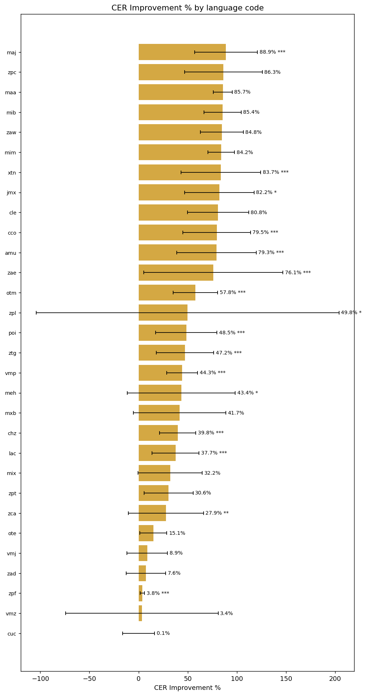

## By superlanguage (n ≥ 3)

| superlanguage   |   Pages |   Base CER |   Fine-tuned CER | CER Improvement   |   Base WER |   Fine-tuned WER |   Base Char Accuracy |   Fine-tuned Char Accuracy |   p-value | Significance   |
|:----------------|--------:|-----------:|-----------------:|:------------------|-----------:|-----------------:|---------------------:|---------------------------:|----------:|:---------------|
| Lacandón        |     431 |     0.3215 |           0.2004 | 37.7%             |     0.5292 |           0.4381 |               0.7284 |                     0.7996 |   0       | ***            |
| Chinanteco      |     412 |     1.049  |           0.2972 | 71.7%             |     0.9538 |           0.602  |               0.5025 |                     0.7145 |   0       | ***            |
| Amuzgo          |     328 |     1.0539 |           0.2185 | 79.3%             |     0.8684 |           0.4006 |               0.5378 |                     0.7855 |   0       | ***            |
| Zapoteco        |     319 |     0.8135 |           0.2494 | 69.3%             |     0.6775 |           0.4654 |               0.5989 |                     0.7542 |   0       | ***            |
| Otomí           |     188 |     0.3178 |           0.1571 | 50.6%             |     0.4358 |           0.3402 |               0.7423 |                     0.8429 |   1e-05   | ***            |
| Mixteco         |     146 |     0.62   |           0.2137 | 65.5%             |     0.5947 |           0.3719 |               0.6136 |                     0.7866 |   0       | ***            |
| Mazateco        |     117 |     1.5053 |           0.2244 | 85.1%             |     0.829  |           0.3163 |               0.5303 |                     0.7911 |   0       | ***            |
| Popoluca        |      16 |     0.1489 |           0.0766 | 48.5%             |     0.5453 |           0.2266 |               0.8511 |                     0.9234 |   0       | ***            |
| Náhuatl         |       6 |     0.2161 |           0.14   | 35.2%             |     0.2732 |           0.261  |               0.7839 |                     0.86   |   0.28809 | ns             |

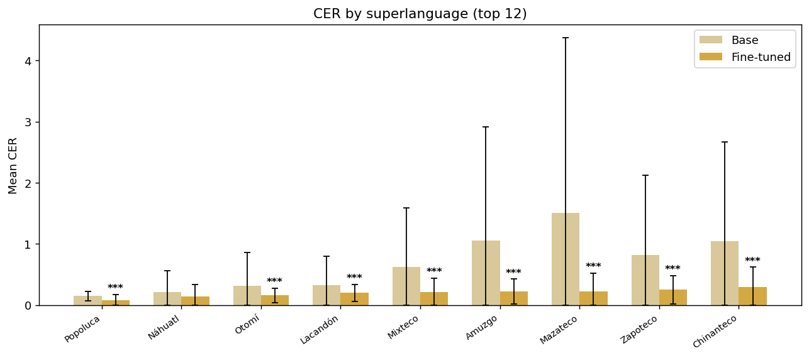

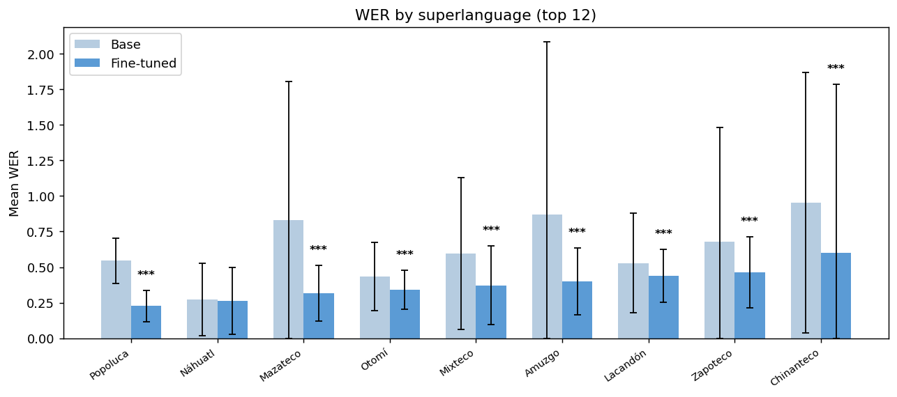

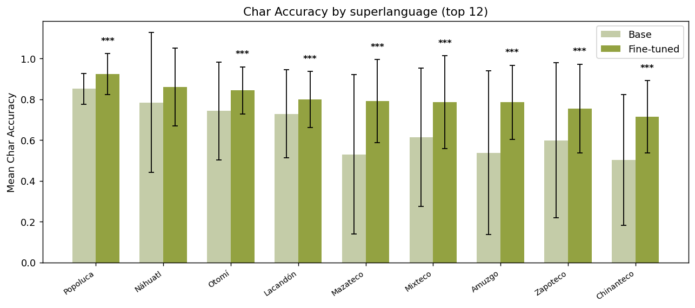

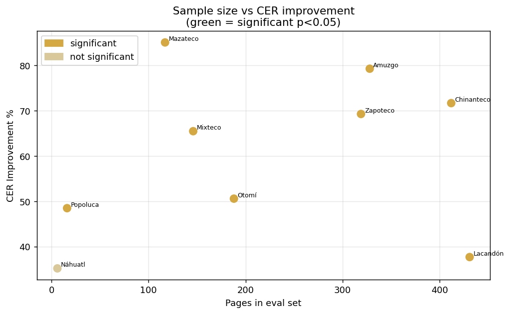

## By family (n ≥ 3)

| family        |   Pages |   Base CER |   Fine-tuned CER | CER Improvement   |   Base WER |   Fine-tuned WER |   Base Char Accuracy |   Fine-tuned Char Accuracy |   p-value | Significance   |
|:--------------|--------:|-----------:|-----------------:|:------------------|-----------:|-----------------:|---------------------:|---------------------------:|----------:|:---------------|
| Otomangue     |    1512 |     0.902  |           0.2388 | 73.5%             |     0.7671 |           0.4523 |               0.5738 |                     0.7672 |    0      | ***            |
| Mayense       |     431 |     0.3215 |           0.2004 | 37.7%             |     0.5292 |           0.4381 |               0.7284 |                     0.7996 |    0      | ***            |
| Mixe-Zoqueano |      16 |     0.1489 |           0.0766 | 48.5%             |     0.5453 |           0.2266 |               0.8511 |                     0.9234 |    0      | ***            |
| Yuto-Nahua    |       8 |     2.383  |           0.3254 | 86.3%             |     3.6416 |           0.4309 |               0.5879 |                     0.6746 |    0.3088 | ns             |

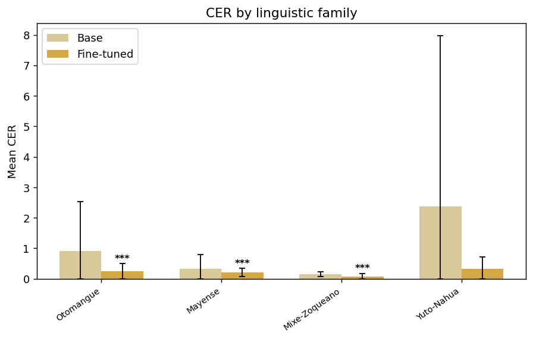

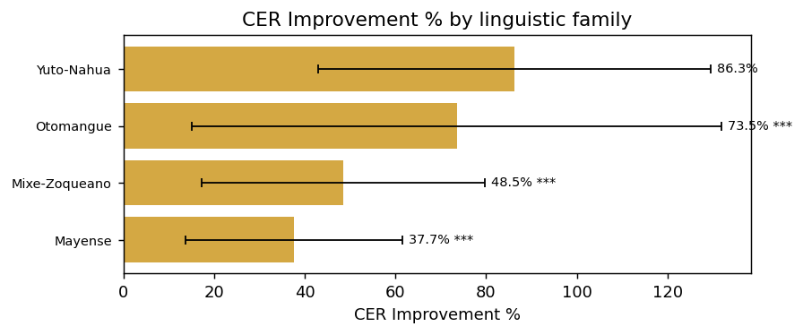

## By collection (n ≥ 3)

| collection    |   Pages |   Base CER |   Fine-tuned CER | CER Improvement   |   Base WER |   Fine-tuned WER |   Base Char Accuracy |   Fine-tuned Char Accuracy |   p-value | Significance   |
|:--------------|--------:|-----------:|-----------------:|:------------------|-----------:|-----------------:|---------------------:|---------------------------:|----------:|:---------------|
| dictionary    |     643 |     0.3566 |           0.2233 | 37.4%             |     0.5935 |           0.4959 |               0.6945 |                     0.7767 |   0       | ***            |
| grammar       |     632 |     0.7301 |           0.203  | 72.2%             |     0.6529 |           0.4187 |               0.6064 |                     0.7982 |   0       | ***            |
| academic      |      44 |     0.2407 |           0.2059 | 14.5%             |     0.422  |           0.4284 |               0.7728 |                     0.7941 |   0.26917 | ns             |
| writing_rules |      35 |     0.8558 |           0.2685 | 68.6%             |     0.7677 |           0.4021 |               0.4591 |                     0.7329 |   0.00037 | ***            |
| legal         |      12 |     0.1241 |           0.0316 | 74.6%             |     0.6203 |           0.2169 |               0.8759 |                     0.9684 |   0       | ***            |
| textbooks     |       4 |     0.4236 |           0.423  | 0.1%              |     0.8218 |           0.6736 |               0.5764 |                     0.577  |   0.98474 | ns             |
| covid         |       3 |     0.2831 |           0.2741 | 3.2%              |     0.3897 |           0.315  |               0.7169 |                     0.7259 |   0.65429 | ns             |
| audio_stories |       3 |     0.0701 |           0.0654 | 6.8%              |     0.1956 |           0.2017 |               0.9299 |                     0.9346 |   0.32438 | ns             |

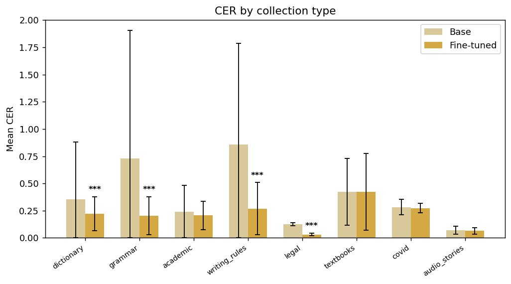

## By source (n ≥ 3)

| source     |   Pages |   Base CER |   Fine-tuned CER | CER Improvement   |   Base WER |   Fine-tuned WER |   Base Char Accuracy |   Fine-tuned Char Accuracy |   p-value | Significance   |
|:-----------|--------:|-----------:|-----------------:|:------------------|-----------:|-----------------:|---------------------:|---------------------------:|----------:|:---------------|
| ilv        |    1937 |     0.7932 |           0.2364 | 70.2%             |     0.7352 |           0.4544 |               0.6026 |                     0.7704 |   0       | ***            |
| books      |      33 |     0.1308 |           0.0728 | 44.3%             |     0.3352 |           0.2811 |               0.8692 |                     0.9272 |   0       | ***            |
| government |      12 |     0.1241 |           0.0316 | 74.6%             |     0.6203 |           0.2169 |               0.8759 |                     0.9684 |   0       | ***            |
| sep        |       4 |     0.4236 |           0.423  | 0.1%              |     0.8218 |           0.6736 |               0.5764 |                     0.577  |   0.98474 | ns             |
| ssa        |       3 |     0.2831 |           0.2741 | 3.2%              |     0.3897 |           0.315  |               0.7169 |                     0.7259 |   0.65429 | ns             |

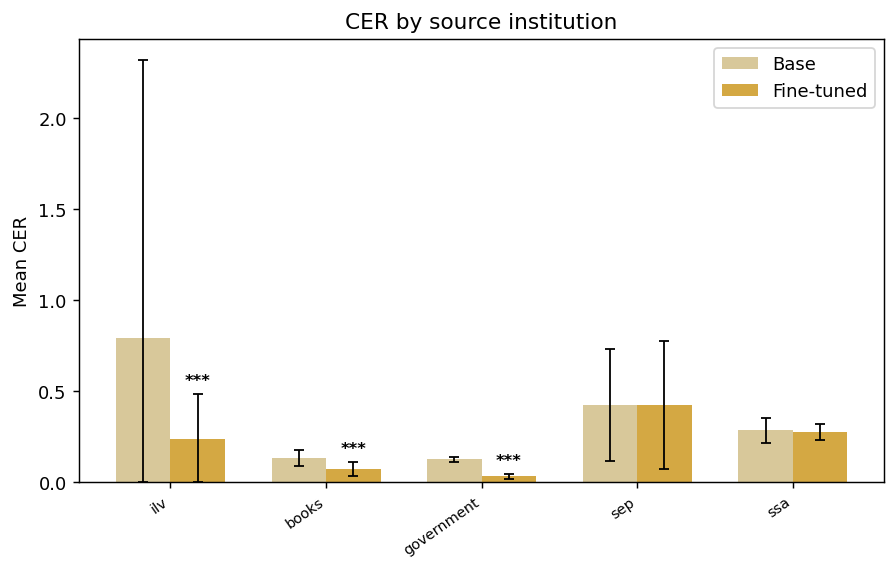

## By document (83 PDFs)

### lac diccionario

`3a3e77f8a79843aa...`

| Field         | Value           |
|:--------------|:----------------|
| name          | lac diccionario |
| code          | lac             |
| language      | lacandón        |
| superlanguage | Lacandón        |
| family        | Mayense         |
| collection    | dictionary      |
| source        | ilv             |
| Pages         | 431             |

|   Base CER |   Fine-tuned CER | CER Improvement   |   Base WER |   Fine-tuned WER |   Base Char Accuracy |   Fine-tuned Char Accuracy |
|-----------:|-----------------:|:------------------|-----------:|-----------------:|---------------------:|---------------------------:|
|     0.3215 |           0.2004 | 37.7%             |     0.5292 |           0.4381 |               0.7284 |                     0.7996 |

### amu gramatica

`3d6086b073801b95...`

| Field         | Value            |
|:--------------|:-----------------|
| name          | amu gramatica    |
| code          | amu              |
| language      | amuzgo del norte |
| superlanguage | Amuzgo           |
| family        | Otomangue        |
| collection    | grammar          |
| source        | ilv              |
| Pages         | 287              |

|   Base CER |   Fine-tuned CER | CER Improvement   |   Base WER |   Fine-tuned WER |   Base Char Accuracy |   Fine-tuned Char Accuracy |
|-----------:|-----------------:|:------------------|-----------:|-----------------:|---------------------:|---------------------------:|
|     0.7126 |            0.186 | 73.9%             |     0.6779 |           0.3788 |               0.5918 |                     0.8165 |

### cco gramatica chinanteca comaltepec

`71478d3b198ef146...`

| Field         | Value                               |
|:--------------|:------------------------------------|
| name          | cco gramatica chinanteca comaltepec |
| code          | cco                                 |
| language      | chinanteco de la Sierra             |
| superlanguage | Chinanteco                          |
| family        | Otomangue                           |
| source        | ilv                                 |
| Pages         | 217                                 |

|   Base CER |   Fine-tuned CER | CER Improvement   |   Base WER |   Fine-tuned WER |   Base Char Accuracy |   Fine-tuned Char Accuracy |
|-----------:|-----------------:|:------------------|-----------:|-----------------:|---------------------:|---------------------------:|
|      1.584 |           0.3245 | 79.5%             |     1.1364 |           0.5833 |               0.4001 |                     0.6975 |

### chz Diccionario chinanteco Ayotzintepec

`3821017ab1735512...`

| Field         | Value                                   |
|:--------------|:----------------------------------------|
| name          | chz Diccionario chinanteco Ayotzintepec |
| code          | chz                                     |
| language      | chinanteco del sureste alto             |
| superlanguage | Chinanteco                              |
| family        | Otomangue                               |
| collection    | dictionary                              |
| source        | ilv                                     |
| Pages         | 187                                     |

|   Base CER |   Fine-tuned CER | CER Improvement   |   Base WER |   Fine-tuned WER |   Base Char Accuracy |   Fine-tuned Char Accuracy |
|-----------:|-----------------:|:------------------|-----------:|-----------------:|---------------------:|---------------------------:|
|     0.4394 |           0.2643 | 39.8%             |     0.7473 |           0.6277 |               0.6212 |                     0.7357 |

### zae gramatica

`095c6bea3354801c...`

| Field         | Value                             |
|:--------------|:----------------------------------|
| name          | zae gramatica                     |
| code          | zae                               |
| language      | zapoteco serrano, del oeste medio |
| superlanguage | Zapoteco                          |
| family        | Otomangue                         |
| collection    | grammar                           |
| source        | ilv                               |
| Pages         | 158                               |

|   Base CER |   Fine-tuned CER | CER Improvement   |   Base WER |   Fine-tuned WER |   Base Char Accuracy |   Fine-tuned Char Accuracy |
|-----------:|-----------------:|:------------------|-----------:|-----------------:|---------------------:|---------------------------:|
|     1.2295 |            0.293 | 76.2%             |     0.8578 |           0.5764 |               0.4725 |                      0.707 |

### otm Gramatica

`5f5480166ad709ee...`

| Field         | Value              |
|:--------------|:-------------------|
| name          | otm Gramatica      |
| code          | otm                |
| language      | otomí de la Sierra |
| superlanguage | Otomí              |
| family        | Otomangue          |
| collection    | grammar            |
| source        | ilv                |
| Pages         | 146                |

|   Base CER |   Fine-tuned CER | CER Improvement   |   Base WER |   Fine-tuned WER |   Base Char Accuracy |   Fine-tuned Char Accuracy |
|-----------:|-----------------:|:------------------|-----------:|-----------------:|---------------------:|---------------------------:|
|     0.3397 |           0.1432 | 57.8%             |     0.4422 |           0.3171 |               0.7337 |                     0.8568 |

### zpl Gramatica

`76027ee43c4c4730...`

| Field         | Value                                    |
|:--------------|:-----------------------------------------|
| name          | zpl Gramatica                            |
| code          | zpl                                      |
| language      | zapoteco de la Sierra sur, noroeste alto |
| superlanguage | Zapoteco                                 |
| family        | Otomangue                                |
| source        | ilv                                      |
| Pages         | 76                                       |

|   Base CER |   Fine-tuned CER | CER Improvement   |   Base WER |   Fine-tuned WER |   Base Char Accuracy |   Fine-tuned Char Accuracy |
|-----------:|-----------------:|:------------------|-----------:|-----------------:|---------------------:|---------------------------:|
|     0.3797 |           0.1904 | 49.8%             |     0.4155 |           0.4257 |               0.7487 |                     0.8096 |

### maj Tinchiyai

`2f22b175f84dfa92...`

| Field         | Value                  |
|:--------------|:-----------------------|
| name          | maj Tinchiyai          |
| code          | maj                    |
| language      | mazateco del este bajo |
| superlanguage | Mazateco               |
| family        | Otomangue              |
| source        | ilv                    |
| Pages         | 64                     |

|   Base CER |   Fine-tuned CER | CER Improvement   |   Base WER |   Fine-tuned WER |   Base Char Accuracy |   Fine-tuned Char Accuracy |
|-----------:|-----------------:|:------------------|-----------:|-----------------:|---------------------:|---------------------------:|
|     2.5339 |           0.2823 | 88.9%             |     1.2113 |           0.3323 |               0.3097 |                     0.7206 |

### amu ljo machee tito

`34245b2168a386da...`

| Field         | Value               |
|:--------------|:--------------------|
| name          | amu ljo machee tito |
| code          | amu                 |
| language      | amuzgo del norte    |
| superlanguage | Amuzgo              |
| family        | Otomangue           |
| source        | ilv                 |
| Pages         | 41                  |

|   Base CER |   Fine-tuned CER | CER Improvement   |   Base WER |   Fine-tuned WER |   Base Char Accuracy |   Fine-tuned Char Accuracy |
|-----------:|-----------------:|:------------------|-----------:|-----------------:|---------------------:|---------------------------:|
|     3.4434 |            0.446 | 87.0%             |      2.202 |           0.5535 |               0.1601 |                      0.569 |

### ote diccionario ed2

`ad1f5fb9694c09be...`

| Field         | Value                         |
|:--------------|:------------------------------|
| name          | ote diccionario ed2           |
| code          | ote                           |
| language      | otomí del Valle del Mezquital |
| superlanguage | Otomí                         |
| family        | Otomangue                     |
| collection    | academic                      |
| source        | ilv                           |
| Pages         | 39                            |

|   Base CER |   Fine-tuned CER | CER Improvement   |   Base WER |   Fine-tuned WER |   Base Char Accuracy |   Fine-tuned Char Accuracy |
|-----------:|-----------------:|:------------------|-----------:|-----------------:|---------------------:|---------------------------:|
|     0.2549 |            0.216 | 15.2%             |     0.4302 |           0.4374 |               0.7603 |                      0.784 |

### mxb gramatica

`e77b53788fcb5df4...`

| Field         | Value                      |
|:--------------|:---------------------------|
| name          | mxb gramatica              |
| code          | mxb                        |
| language      | mixteco del noroeste medio |
| superlanguage | Mixteco                    |
| family        | Otomangue                  |
| collection    | grammar                    |
| source        | ilv                        |
| Pages         | 38                         |

|   Base CER |   Fine-tuned CER | CER Improvement   |   Base WER |   Fine-tuned WER |   Base Char Accuracy |   Fine-tuned Char Accuracy |
|-----------:|-----------------:|:------------------|-----------:|-----------------:|---------------------:|---------------------------:|
|     0.2591 |           0.1874 | 27.7%             |     0.4203 |           0.4625 |               0.7858 |                     0.8126 |

### vmp const cdmx

`6fe4c85920beb343...`

| Field         | Value                |
|:--------------|:---------------------|
| name          | vmp const cdmx       |
| code          | vmp                  |
| language      | mazateco del noreste |
| superlanguage | Mazateco             |
| family        | Otomangue            |
| source        | books                |
| Pages         | 33                   |

|   Base CER |   Fine-tuned CER | CER Improvement   |   Base WER |   Fine-tuned WER |   Base Char Accuracy |   Fine-tuned Char Accuracy |
|-----------:|-----------------:|:------------------|-----------:|-----------------:|---------------------:|---------------------------:|
|     0.1308 |           0.0728 | 44.3%             |     0.3352 |           0.2811 |               0.8692 |                     0.9272 |

### xtn Como escribimos vol2

`27bfbeb48121e049...`

| Field         | Value                    |
|:--------------|:-------------------------|
| name          | xtn Como escribimos vol2 |
| code          | xtn                      |
| language      | mixteco del norte bajo   |
| superlanguage | Mixteco                  |
| family        | Otomangue                |
| source        | ilv                      |
| Pages         | 29                       |

|   Base CER |   Fine-tuned CER | CER Improvement   |   Base WER |   Fine-tuned WER |   Base Char Accuracy |   Fine-tuned Char Accuracy |
|-----------:|-----------------:|:------------------|-----------:|-----------------:|---------------------:|---------------------------:|
|     1.2138 |            0.197 | 83.8%             |     0.7468 |           0.3365 |               0.4022 |                      0.803 |

### vmz Tiempo

`e4553310cc432185...`

| Field         | Value                 |
|:--------------|:----------------------|
| name          | vmz Tiempo            |
| code          | vmz                   |
| language      | mazateco del suroeste |
| superlanguage | Mazateco              |
| family        | Otomangue             |
| source        | ilv                   |
| Pages         | 17                    |

|   Base CER |   Fine-tuned CER | CER Improvement   |   Base WER |   Fine-tuned WER |   Base Char Accuracy |   Fine-tuned Char Accuracy |
|-----------:|-----------------:|:------------------|-----------:|-----------------:|---------------------:|---------------------------:|
|     0.3147 |            0.304 | 3.4%              |     0.3315 |           0.3137 |               0.7777 |                     0.7916 |

### zad Adivinanzas

`36455bcc9617625d...`

| Field   | Value           |
|:--------|:----------------|
| name    | zad Adivinanzas |
| code    | zad             |
| source  | ilv             |
| Pages   | 14              |

|   Base CER |   Fine-tuned CER | CER Improvement   |   Base WER |   Fine-tuned WER |   Base Char Accuracy |   Fine-tuned Char Accuracy |
|-----------:|-----------------:|:------------------|-----------:|-----------------:|---------------------:|---------------------------:|
|     0.7247 |           0.6656 | 8.2%              |     0.9248 |           0.8327 |               0.5755 |                     0.6289 |

### mxb 2019Leamos en Mixteco

`61a49a986c3b4c37...`

| Field         | Value                      |
|:--------------|:---------------------------|
| name          | mxb 2019Leamos en Mixteco  |
| code          | mxb                        |
| language      | mixteco del noroeste medio |
| superlanguage | Mixteco                    |
| family        | Otomangue                  |
| source        | ilv                        |
| Pages         | 12                         |

|   Base CER |   Fine-tuned CER | CER Improvement   |   Base WER |   Fine-tuned WER |   Base Char Accuracy |   Fine-tuned Char Accuracy |
|-----------:|-----------------:|:------------------|-----------:|-----------------:|---------------------:|---------------------------:|
|     0.6864 |           0.2857 | 58.4%             |     0.9072 |           0.3742 |               0.5732 |                     0.7143 |

### poi

`68668118d10d08c7...`

| Field         | Value                 |
|:--------------|:----------------------|
| name          | poi                   |
| code          | poi                   |
| language      | popoluca de la Sierra |
| superlanguage | Popoluca              |
| family        | Mixe-Zoqueano         |
| collection    | legal                 |
| source        | government            |
| Pages         | 12                    |

|   Base CER |   Fine-tuned CER | CER Improvement   |   Base WER |   Fine-tuned WER |   Base Char Accuracy |   Fine-tuned Char Accuracy |
|-----------:|-----------------:|:------------------|-----------:|-----------------:|---------------------:|---------------------------:|
|     0.1241 |           0.0316 | 74.6%             |     0.6203 |           0.2169 |               0.8759 |                     0.9684 |

### zpf como mueve tierra

`cfc885bd45a69539...`

| Field         | Value                                    |
|:--------------|:-----------------------------------------|
| name          | zpf como mueve tierra                    |
| code          | zpf                                      |
| language      | zapoteco de Sierra sur, del noreste alto |
| superlanguage | Zapoteco                                 |
| family        | Otomangue                                |
| source        | ilv                                      |
| Pages         | 9                                        |

|   Base CER |   Fine-tuned CER | CER Improvement   |   Base WER |   Fine-tuned WER |   Base Char Accuracy |   Fine-tuned Char Accuracy |
|-----------:|-----------------:|:------------------|-----------:|-----------------:|---------------------:|---------------------------:|
|     0.9057 |           0.8709 | 3.8%              |     0.4417 |           0.2924 |               0.2317 |                     0.2562 |

### zad Mi peque%C3%B1o diccionario ilustrado

`de6b84e9223cef4c...`

| Field      | Value                                     |
|:-----------|:------------------------------------------|
| name       | zad Mi peque%C3%B1o diccionario ilustrado |
| code       | zad                                       |
| collection | dictionary                                |
| source     | ilv                                       |
| Pages      | 8                                         |

|   Base CER |   Fine-tuned CER | CER Improvement   |   Base WER |   Fine-tuned WER |   Base Char Accuracy |   Fine-tuned Char Accuracy |
|-----------:|-----------------:|:------------------|-----------:|-----------------:|---------------------:|---------------------------:|
|     0.2644 |           0.2519 | 4.7%              |     0.5303 |           0.5044 |               0.7356 |                     0.7481 |

### ztg luna sol

`9a0c0107c8bbc6e5...`

| Field         | Value                                       |
|:--------------|:--------------------------------------------|
| name          | ztg luna sol                                |
| code          | ztg                                         |
| language      | zapoteco de la Sierra sur, del sureste alto |
| superlanguage | Zapoteco                                    |
| family        | Otomangue                                   |
| source        | ilv                                         |
| Pages         | 7                                           |

|   Base CER |   Fine-tuned CER | CER Improvement   |   Base WER |   Fine-tuned WER |   Base Char Accuracy |   Fine-tuned Char Accuracy |
|-----------:|-----------------:|:------------------|-----------:|-----------------:|---------------------:|---------------------------:|
|     0.2191 |           0.0685 | 68.7%             |     0.4542 |           0.1857 |               0.7809 |                     0.9315 |

### meh palabras pronuncian aire saliendo nariz leer

`ed3d5f294fc37eff...`

| Field         | Value                                            |
|:--------------|:-------------------------------------------------|
| name          | meh palabras pronuncian aire saliendo nariz leer |
| code          | meh                                              |
| language      | mixteco del suroeste                             |
| superlanguage | Mixteco                                          |
| family        | Otomangue                                        |
| collection    | writing_rules                                    |
| source        | ilv                                              |
| Pages         | 7                                                |

|   Base CER |   Fine-tuned CER | CER Improvement   |   Base WER |   Fine-tuned WER |   Base Char Accuracy |   Fine-tuned Char Accuracy |
|-----------:|-----------------:|:------------------|-----------:|-----------------:|---------------------:|---------------------------:|
|     0.6117 |           0.4138 | 32.4%             |     0.7759 |           0.4238 |               0.5506 |                     0.5929 |

### ztg algunos numeros

`4d4a37fa1f9a367b...`

| Field         | Value                                       |
|:--------------|:--------------------------------------------|
| name          | ztg algunos numeros                         |
| code          | ztg                                         |
| language      | zapoteco de la Sierra sur, del sureste alto |
| superlanguage | Zapoteco                                    |
| family        | Otomangue                                   |
| collection    | dictionary                                  |
| source        | ilv                                         |
| Pages         | 7                                           |

|   Base CER |   Fine-tuned CER | CER Improvement   |   Base WER |   Fine-tuned WER |   Base Char Accuracy |   Fine-tuned Char Accuracy |
|-----------:|-----------------:|:------------------|-----------:|-----------------:|---------------------:|---------------------------:|
|     0.3047 |           0.2312 | 24.1%             |     0.6879 |           0.4957 |               0.6953 |                     0.7688 |

### zae cielo

`3c2990bd444eb19c...`

| Field         | Value                             |
|:--------------|:----------------------------------|
| name          | zae cielo                         |
| code          | zae                               |
| language      | zapoteco serrano, del oeste medio |
| superlanguage | Zapoteco                          |
| family        | Otomangue                         |
| source        | ilv                               |
| Pages         | 7                                 |

|   Base CER |   Fine-tuned CER | CER Improvement   |   Base WER |   Fine-tuned WER |   Base Char Accuracy |   Fine-tuned Char Accuracy |
|-----------:|-----------------:|:------------------|-----------:|-----------------:|---------------------:|---------------------------:|
|     0.0305 |           0.0207 | 32.3%             |      0.159 |           0.1053 |               0.9695 |                     0.9793 |

### meh letra saltillo

`584772a529cdf181...`

| Field         | Value                |
|:--------------|:---------------------|
| name          | meh letra saltillo   |
| code          | meh                  |
| language      | mixteco del suroeste |
| superlanguage | Mixteco              |
| family        | Otomangue            |
| collection    | writing_rules        |
| source        | ilv                  |
| Pages         | 6                    |

|   Base CER |   Fine-tuned CER | CER Improvement   |   Base WER |   Fine-tuned WER |   Base Char Accuracy |   Fine-tuned Char Accuracy |
|-----------:|-----------------:|:------------------|-----------:|-----------------:|---------------------:|---------------------------:|
|     0.5894 |           0.3199 | 45.7%             |     0.7154 |            0.491 |                0.412 |                     0.6801 |

### jmx Mixteco Oeste Juxtlahuaca convenciones escribir

`4062e8b51dbe26fc...`

| Field         | Value                                               |
|:--------------|:----------------------------------------------------|
| name          | jmx Mixteco Oeste Juxtlahuaca convenciones escribir |
| code          | jmx                                                 |
| language      | mixteco del oeste                                   |
| superlanguage | Mixteco                                             |
| family        | Otomangue                                           |
| source        | ilv                                                 |
| Pages         | 6                                                   |

|   Base CER |   Fine-tuned CER | CER Improvement   |   Base WER |   Fine-tuned WER |   Base Char Accuracy |   Fine-tuned Char Accuracy |
|-----------:|-----------------:|:------------------|-----------:|-----------------:|---------------------:|---------------------------:|
|     1.2067 |           0.1111 | 90.8%             |     0.6112 |           0.2704 |               0.4551 |                     0.8889 |

### mim convOrt

`46732de90223332b...`

| Field         | Value                       |
|:--------------|:----------------------------|
| name          | mim convOrt                 |
| code          | mim                         |
| language      | mixteco central de Guerrero |
| superlanguage | Mixteco                     |
| family        | Otomangue                   |
| collection    | writing_rules               |
| source        | ilv                         |
| Pages         | 6                           |

|   Base CER |   Fine-tuned CER | CER Improvement   |   Base WER |   Fine-tuned WER |   Base Char Accuracy |   Fine-tuned Char Accuracy |
|-----------:|-----------------:|:------------------|-----------:|-----------------:|---------------------:|---------------------------:|
|     0.8157 |           0.1286 | 84.2%             |      0.538 |           0.1791 |               0.4766 |                     0.8714 |

### ztg alimentos comen otros lugares

`a46165de35378e04...`

| Field         | Value                                       |
|:--------------|:--------------------------------------------|
| name          | ztg alimentos comen otros lugares           |
| code          | ztg                                         |
| language      | zapoteco de la Sierra sur, del sureste alto |
| superlanguage | Zapoteco                                    |
| family        | Otomangue                                   |
| source        | ilv                                         |
| Pages         | 6                                           |

|   Base CER |   Fine-tuned CER | CER Improvement   |   Base WER |   Fine-tuned WER |   Base Char Accuracy |   Fine-tuned Char Accuracy |
|-----------:|-----------------:|:------------------|-----------:|-----------------:|---------------------:|---------------------------:|
|     0.2642 |           0.1313 | 50.3%             |     0.4462 |           0.2649 |               0.7358 |                     0.8687 |

### zaw juan el carbonero

`22f280a28bcd8ac3...`

| Field         | Value                              |
|:--------------|:-----------------------------------|
| name          | zaw juan el carbonero              |
| code          | zaw                                |
| language      | zapoteco de Valles, del este medio |
| superlanguage | Zapoteco                           |
| family        | Otomangue                          |
| source        | ilv                                |
| Pages         | 6                                  |

|   Base CER |   Fine-tuned CER | CER Improvement   |   Base WER |   Fine-tuned WER |   Base Char Accuracy |   Fine-tuned Char Accuracy |
|-----------:|-----------------:|:------------------|-----------:|-----------------:|---------------------:|---------------------------:|
|     1.2497 |             0.19 | 84.8%             |     1.4656 |           0.2731 |               0.7604 |                       0.81 |

### mix parangon

`ea546774e6a90ef4...`

| Field         | Value           |
|:--------------|:----------------|
| name          | mix parangon    |
| code          | mix             |
| language      | mixteco de Ñumi |
| superlanguage | Mixteco         |
| family        | Otomangue       |
| source        | ilv             |
| Pages         | 6               |

|   Base CER |   Fine-tuned CER | CER Improvement   |   Base WER |   Fine-tuned WER |   Base Char Accuracy |   Fine-tuned Char Accuracy |
|-----------:|-----------------:|:------------------|-----------:|-----------------:|---------------------:|---------------------------:|
|     0.8429 |           0.3727 | 55.8%             |     0.6459 |           0.4435 |               0.5869 |                     0.6273 |

### jmxCON hagamos pan trigo miel leer

`667ea7b6fb5fb171...`

| Field         | Value                              |
|:--------------|:-----------------------------------|
| name          | jmxCON hagamos pan trigo miel leer |
| code          | jmx                                |
| language      | mixteco del oeste                  |
| superlanguage | Mixteco                            |
| family        | Otomangue                          |
| source        | ilv                                |
| Pages         | 5                                  |

|   Base CER |   Fine-tuned CER | CER Improvement   |   Base WER |   Fine-tuned WER |   Base Char Accuracy |   Fine-tuned Char Accuracy |
|-----------:|-----------------:|:------------------|-----------:|-----------------:|---------------------:|---------------------------:|
|     0.2758 |            0.028 | 89.8%             |     0.5817 |           0.1263 |               0.7242 |                      0.972 |

### ztg siembra milpa

`9a69b11b32d0a11a...`

| Field         | Value                                       |
|:--------------|:--------------------------------------------|
| name          | ztg siembra milpa                           |
| code          | ztg                                         |
| language      | zapoteco de la Sierra sur, del sureste alto |
| superlanguage | Zapoteco                                    |
| family        | Otomangue                                   |
| source        | ilv                                         |
| Pages         | 5                                           |

|   Base CER |   Fine-tuned CER | CER Improvement   |   Base WER |   Fine-tuned WER |   Base Char Accuracy |   Fine-tuned Char Accuracy |
|-----------:|-----------------:|:------------------|-----------:|-----------------:|---------------------:|---------------------------:|
|     0.3272 |            0.144 | 56.0%             |     0.4721 |           0.2328 |               0.6728 |                      0.856 |

### documento 4

`b9503fb0bef280cf...`

| Field      | Value       |
|:-----------|:------------|
| name       | documento 4 |
| collection | academic    |
| Pages      | 5           |

|   Base CER |   Fine-tuned CER | CER Improvement   |   Base WER |   Fine-tuned WER |   Base Char Accuracy |   Fine-tuned Char Accuracy |
|-----------:|-----------------:|:------------------|-----------:|-----------------:|---------------------:|---------------------------:|
|       0.13 |           0.1268 | 2.4%              |     0.3581 |            0.358 |                 0.87 |                     0.8732 |

### meh gato

`7271ff9181682598...`

| Field         | Value                |
|:--------------|:---------------------|
| name          | meh gato             |
| code          | meh                  |
| language      | mixteco del suroeste |
| superlanguage | Mixteco              |
| family        | Otomangue            |
| source        | ilv                  |
| Pages         | 5                    |

|   Base CER |   Fine-tuned CER | CER Improvement   |   Base WER |   Fine-tuned WER |   Base Char Accuracy |   Fine-tuned Char Accuracy |
|-----------:|-----------------:|:------------------|-----------:|-----------------:|---------------------:|---------------------------:|
|     0.1739 |            0.028 | 83.9%             |     0.4416 |           0.0841 |               0.8261 |                      0.972 |

### mib LeerMixteco

`840d1c3e70dda466...`

| Field   | Value           |
|:--------|:----------------|
| name    | mib LeerMixteco |
| code    | mib             |
| source  | ilv             |
| Pages   | 5               |

|   Base CER |   Fine-tuned CER | CER Improvement   |   Base WER |   Fine-tuned WER |   Base Char Accuracy |   Fine-tuned Char Accuracy |
|-----------:|-----------------:|:------------------|-----------:|-----------------:|---------------------:|---------------------------:|
|     1.7794 |           0.2591 | 85.4%             |     0.9562 |           0.2786 |               0.3467 |                     0.7409 |

### zpc ConvOrth

`e9fddd9c8047918c...`

| Field         | Value                          |
|:--------------|:-------------------------------|
| name          | zpc ConvOrth                   |
| code          | zpc                            |
| language      | zapoteco del oeste de Tuxtepec |
| superlanguage | Zapoteco                       |
| family        | Otomangue                      |
| collection    | writing_rules                  |
| source        | ilv                            |
| Pages         | 5                              |

|   Base CER |   Fine-tuned CER | CER Improvement   |   Base WER |   Fine-tuned WER |   Base Char Accuracy |   Fine-tuned Char Accuracy |
|-----------:|-----------------:|:------------------|-----------:|-----------------:|---------------------:|---------------------------:|
|     1.1948 |           0.1638 | 86.3%             |      1.043 |           0.4311 |               0.5202 |                     0.8362 |

### jau jm kie jé jeu jëi

`ec2506ab3f4217eb...`

| Field         | Value                             |
|:--------------|:----------------------------------|
| name          | jau jm kie jé jeu jëi             |
| code          | cuc                               |
| language      | chinanteco del oeste central alto |
| superlanguage | Chinanteco                        |
| family        | Otomangue                         |
| collection    | textbooks                         |
| source        | sep                               |
| Pages         | 4                                 |

|   Base CER |   Fine-tuned CER | CER Improvement   |   Base WER |   Fine-tuned WER |   Base Char Accuracy |   Fine-tuned Char Accuracy |
|-----------:|-----------------:|:------------------|-----------:|-----------------:|---------------------:|---------------------------:|
|     0.4236 |            0.423 | 0.1%              |     0.8218 |           0.6736 |               0.5764 |                      0.577 |

### mix aves

`2b3e63ae5fc1805a...`

| Field         | Value           |
|:--------------|:----------------|
| name          | mix aves        |
| code          | mix             |
| language      | mixteco de Ñumi |
| superlanguage | Mixteco         |
| family        | Otomangue       |
| collection    | dictionary      |
| source        | ilv             |
| Pages         | 4               |

|   Base CER |   Fine-tuned CER | CER Improvement   |   Base WER |   Fine-tuned WER |   Base Char Accuracy |   Fine-tuned Char Accuracy |
|-----------:|-----------------:|:------------------|-----------:|-----------------:|---------------------:|---------------------------:|
|     0.7011 |           0.7726 | -10.2%            |     0.5458 |            0.754 |               0.2989 |                     0.2274 |

### jmx joven rico

`6d6ae2fd81db600d...`

| Field         | Value             |
|:--------------|:------------------|
| name          | jmx joven rico    |
| code          | jmx               |
| language      | mixteco del oeste |
| superlanguage | Mixteco           |
| family        | Otomangue         |
| source        | ilv               |
| Pages         | 4                 |

|   Base CER |   Fine-tuned CER | CER Improvement   |   Base WER |   Fine-tuned WER |   Base Char Accuracy |   Fine-tuned Char Accuracy |
|-----------:|-----------------:|:------------------|-----------:|-----------------:|---------------------:|---------------------------:|
|     0.2558 |            0.032 | 87.5%             |     0.5572 |           0.1377 |               0.7442 |                      0.968 |

### cle propusta convenciones escribir

`5a8c538b77121131...`

| Field         | Value                              |
|:--------------|:-----------------------------------|
| name          | cle propusta convenciones escribir |
| code          | cle                                |
| language      | chinanteco central                 |
| superlanguage | Chinanteco                         |
| family        | Otomangue                          |
| collection    | writing_rules                      |
| source        | ilv                                |
| Pages         | 4                                  |

|   Base CER |   Fine-tuned CER | CER Improvement   |   Base WER |   Fine-tuned WER |   Base Char Accuracy |   Fine-tuned Char Accuracy |
|-----------:|-----------------:|:------------------|-----------:|-----------------:|---------------------:|---------------------------:|
|     1.1483 |           0.2208 | 80.8%             |     0.8331 |           0.3423 |               0.4376 |                     0.7792 |

### zca para gente coatecas altas

`19185af8e6fa6426...`

| Field         | Value                         |
|:--------------|:------------------------------|
| name          | zca para gente coatecas altas |
| code          | zca                           |
| language      | zapoteco de Valles del sur    |
| superlanguage | Zapoteco                      |
| family        | Otomangue                     |
| source        | ilv                           |
| Pages         | 4                             |

|   Base CER |   Fine-tuned CER | CER Improvement   |   Base WER |   Fine-tuned WER |   Base Char Accuracy |   Fine-tuned Char Accuracy |
|-----------:|-----------------:|:------------------|-----------:|-----------------:|---------------------:|---------------------------:|
|     0.1042 |           0.0098 | 90.6%             |     0.4283 |           0.0292 |               0.8958 |                     0.9902 |

### maa propuesta escribir eloxochitlan

`ea3037cbf633149a...`

| Field         | Value                               |
|:--------------|:------------------------------------|
| name          | maa propuesta escribir eloxochitlan |
| code          | maa                                 |
| language      | mazateco de Tecóatl                 |
| superlanguage | Mazateco                            |
| family        | Otomangue                           |
| collection    | writing_rules                       |
| source        | ilv                                 |
| Pages         | 3                                   |

|   Base CER |   Fine-tuned CER | CER Improvement   |   Base WER |   Fine-tuned WER |   Base Char Accuracy |   Fine-tuned Char Accuracy |
|-----------:|-----------------:|:------------------|-----------:|-----------------:|---------------------:|---------------------------:|
|     1.4269 |           0.2046 | 85.7%             |     0.9245 |           0.3769 |               0.1063 |                     0.7954 |

### popoluca-de-la-sierra-guia-atencion-pueblos-indigenas-afrome

`a241ac3dbdebe054...`

| Field         | Value                                                                      |
|:--------------|:---------------------------------------------------------------------------|
| name          | popoluca-de-la-sierra-guia-atencion-pueblos-indigenas-afromexicano-covid19 |
| code          | poi                                                                        |
| language      | popoluca de la Sierra                                                      |
| superlanguage | Popoluca                                                                   |
| family        | Mixe-Zoqueano                                                              |
| collection    | covid                                                                      |
| source        | ssa                                                                        |
| Pages         | 3                                                                          |

|   Base CER |   Fine-tuned CER | CER Improvement   |   Base WER |   Fine-tuned WER |   Base Char Accuracy |   Fine-tuned Char Accuracy |
|-----------:|-----------------:|:------------------|-----------:|-----------------:|---------------------:|---------------------------:|
|     0.2831 |           0.2741 | 3.2%              |     0.3897 |            0.315 |               0.7169 |                     0.7259 |

### ztg hombre flojo

`8bcf7d7919892771...`

| Field         | Value                                       |
|:--------------|:--------------------------------------------|
| name          | ztg hombre flojo                            |
| code          | ztg                                         |
| language      | zapoteco de la Sierra sur, del sureste alto |
| superlanguage | Zapoteco                                    |
| family        | Otomangue                                   |
| source        | ilv                                         |
| Pages         | 3                                           |

|   Base CER |   Fine-tuned CER | CER Improvement   |   Base WER |   Fine-tuned WER |   Base Char Accuracy |   Fine-tuned Char Accuracy |
|-----------:|-----------------:|:------------------|-----------:|-----------------:|---------------------:|---------------------------:|
|     0.1172 |           0.0459 | 60.8%             |     0.3615 |           0.1704 |               0.8828 |                     0.9541 |

### jmx construir casas adobe

`7a41e4090bed3bf0...`

| Field         | Value                     |
|:--------------|:--------------------------|
| name          | jmx construir casas adobe |
| code          | jmx                       |
| language      | mixteco del oeste         |
| superlanguage | Mixteco                   |
| family        | Otomangue                 |
| source        | ilv                       |
| Pages         | 3                         |

|   Base CER |   Fine-tuned CER | CER Improvement   |   Base WER |   Fine-tuned WER |   Base Char Accuracy |   Fine-tuned Char Accuracy |
|-----------:|-----------------:|:------------------|-----------:|-----------------:|---------------------:|---------------------------:|
|     0.3156 |           0.2556 | 19.0%             |     0.5993 |            0.554 |               0.6844 |                     0.7444 |

### xtn GramPopular

`187fe1ca20a09c8e...`

| Field         | Value                  |
|:--------------|:-----------------------|
| name          | xtn GramPopular        |
| code          | xtn                    |
| language      | mixteco del norte bajo |
| superlanguage | Mixteco                |
| family        | Otomangue              |
| collection    | grammar                |
| source        | ilv                    |
| Pages         | 3                      |

|   Base CER |   Fine-tuned CER | CER Improvement   |   Base WER |   Fine-tuned WER |   Base Char Accuracy |   Fine-tuned Char Accuracy |
|-----------:|-----------------:|:------------------|-----------:|-----------------:|---------------------:|---------------------------:|
|      1.075 |           0.1883 | 82.5%             |     0.6726 |           0.3263 |               0.5831 |                     0.8117 |

### cdi-vocabulario-mazahua-rufino-benitez-reyna-web

`045aa9ce6e035d54...`

| Field         | Value                                            |
|:--------------|:-------------------------------------------------|
| name          | cdi-vocabulario-mazahua-rufino-benitez-reyna-web |
| code          | mmc                                              |
| language      | mazahua de occidente                             |
| superlanguage | Mazahua                                          |
| family        | Otomangue                                        |
| collection    | books                                            |
| Pages         | 2                                                |

|   Base CER |   Fine-tuned CER | CER Improvement   |   Base WER |   Fine-tuned WER |   Base Char Accuracy |   Fine-tuned Char Accuracy |
|-----------:|-----------------:|:------------------|-----------:|-----------------:|---------------------:|---------------------------:|
|     0.0539 |           0.2376 | -340.8%           |     0.1365 |           0.3714 |               0.9461 |                     0.7624 |

### nhx 23e Fonemas nhx

`0c4f343b8bdd326f...`

| Field         | Value               |
|:--------------|:--------------------|
| name          | nhx 23e Fonemas nhx |
| code          | nhx                 |
| language      | náhuatl del Istmo   |
| superlanguage | Náhuatl             |
| family        | Yuto-Nahua          |
| source        | ilv                 |
| Pages         | 2                   |

|   Base CER |   Fine-tuned CER | CER Improvement   |   Base WER |   Fine-tuned WER |   Base Char Accuracy |   Fine-tuned Char Accuracy |
|-----------:|-----------------:|:------------------|-----------:|-----------------:|---------------------:|---------------------------:|
|     0.4992 |           0.2997 | 40.0%             |     0.4838 |           0.4459 |               0.5008 |                     0.7003 |

### zpt diccionario ilustrado

`18ad1681fa9da635...`

| Field         | Value                           |
|:--------------|:--------------------------------|
| name          | zpt diccionario ilustrado       |
| code          | zpt                             |
| language      | zapoteco de San Vicente Coatlán |
| superlanguage | Zapoteco                        |
| family        | Otomangue                       |
| collection    | dictionary                      |
| source        | ilv                             |
| Pages         | 2                               |

|   Base CER |   Fine-tuned CER | CER Improvement   |   Base WER |   Fine-tuned WER |   Base Char Accuracy |   Fine-tuned Char Accuracy |
|-----------:|-----------------:|:------------------|-----------:|-----------------:|---------------------:|---------------------------:|
|     0.3165 |           0.2904 | 8.2%              |     0.4875 |           0.3916 |               0.6835 |                     0.7095 |

### nlv Bocadillos

`8afc195e0669f307...`

| Field         | Value                       |
|:--------------|:----------------------------|
| name          | nlv Bocadillos              |
| code          | nlv                         |
| language      | náhuatl central de Veracruz |
| superlanguage | Náhuatl                     |
| family        | Yuto-Nahua                  |
| source        | ilv                         |
| Pages         | 2                           |

|   Base CER |   Fine-tuned CER | CER Improvement   |   Base WER |   Fine-tuned WER |   Base Char Accuracy |   Fine-tuned Char Accuracy |
|-----------:|-----------------:|:------------------|-----------:|-----------------:|---------------------:|---------------------------:|
|      0.039 |           0.0078 | 80.1%             |      0.058 |           0.0272 |                0.961 |                     0.9922 |

### ncl Diccionario

`933d3e8df3a6a832...`

| Field         | Value                         |
|:--------------|:------------------------------|
| name          | ncl Diccionario               |
| code          | ncl                           |
| language      | mexicano central de occidente |
| superlanguage | Náhuatl                       |
| family        | Yuto-Nahua                    |
| collection    | dictionary                    |
| source        | ilv                           |
| Pages         | 2                             |

|   Base CER |   Fine-tuned CER | CER Improvement   |   Base WER |   Fine-tuned WER |   Base Char Accuracy |   Fine-tuned Char Accuracy |
|-----------:|-----------------:|:------------------|-----------:|-----------------:|---------------------:|---------------------------:|
|     0.1102 |           0.1124 | -2.0%             |     0.2778 |             0.31 |               0.8898 |                     0.8876 |

### vmj Sikiyo

`27aa69f65c2536c8...`

| Field         | Value                |
|:--------------|:---------------------|
| name          | vmj Sikiyo           |
| code          | vmj                  |
| language      | mixteco de Ixtayutla |
| superlanguage | Mixteco              |
| family        | Otomangue            |
| source        | ilv                  |
| Pages         | 2                    |

|   Base CER |   Fine-tuned CER | CER Improvement   |   Base WER |   Fine-tuned WER |   Base Char Accuracy |   Fine-tuned Char Accuracy |
|-----------:|-----------------:|:------------------|-----------:|-----------------:|---------------------:|---------------------------:|
|     0.3149 |           0.2718 | 13.7%             |     0.5692 |            0.525 |               0.6851 |                     0.7283 |

### zpt pequeno dicc ilustrado

`3a83a48c09410806...`

| Field         | Value                           |
|:--------------|:--------------------------------|
| name          | zpt pequeno dicc ilustrado      |
| code          | zpt                             |
| language      | zapoteco de San Vicente Coatlán |
| superlanguage | Zapoteco                        |
| family        | Otomangue                       |
| collection    | dictionary                      |
| source        | ilv                             |
| Pages         | 2                               |

|   Base CER |   Fine-tuned CER | CER Improvement   |   Base WER |   Fine-tuned WER |   Base Char Accuracy |   Fine-tuned Char Accuracy |
|-----------:|-----------------:|:------------------|-----------:|-----------------:|---------------------:|---------------------------:|
|      0.317 |           0.1491 | 53.0%             |     0.5046 |            0.374 |               0.6829 |                      0.851 |

### ztg hacer rehilete leer

`3cc961619d7447a3...`

| Field         | Value                                       |
|:--------------|:--------------------------------------------|
| name          | ztg hacer rehilete leer                     |
| code          | ztg                                         |
| language      | zapoteco de la Sierra sur, del sureste alto |
| superlanguage | Zapoteco                                    |
| family        | Otomangue                                   |
| source        | ilv                                         |
| Pages         | 2                                           |

|   Base CER |   Fine-tuned CER | CER Improvement   |   Base WER |   Fine-tuned WER |   Base Char Accuracy |   Fine-tuned Char Accuracy |
|-----------:|-----------------:|:------------------|-----------:|-----------------:|---------------------:|---------------------------:|
|     0.1641 |           0.0675 | 58.9%             |     0.4249 |           0.1826 |               0.8359 |                     0.9326 |

### ztg no hay comer

`7c50115f3dd6def7...`

| Field         | Value                                       |
|:--------------|:--------------------------------------------|
| name          | ztg no hay comer                            |
| code          | ztg                                         |
| language      | zapoteco de la Sierra sur, del sureste alto |
| superlanguage | Zapoteco                                    |
| family        | Otomangue                                   |
| source        | ilv                                         |
| Pages         | 2                                           |

|   Base CER |   Fine-tuned CER | CER Improvement   |   Base WER |   Fine-tuned WER |   Base Char Accuracy |   Fine-tuned Char Accuracy |
|-----------:|-----------------:|:------------------|-----------:|-----------------:|---------------------:|---------------------------:|
|      0.279 |           0.0485 | 82.6%             |     0.4786 |           0.1612 |                0.721 |                     0.9515 |

### zca benito juarez

`3bdde4164c4c074a...`

| Field         | Value                      |
|:--------------|:---------------------------|
| name          | zca benito juarez          |
| code          | zca                        |
| language      | zapoteco de Valles del sur |
| superlanguage | Zapoteco                   |
| family        | Otomangue                  |
| source        | ilv                        |
| Pages         | 2                          |

|   Base CER |   Fine-tuned CER | CER Improvement   |   Base WER |   Fine-tuned WER |   Base Char Accuracy |   Fine-tuned Char Accuracy |
|-----------:|-----------------:|:------------------|-----------:|-----------------:|---------------------:|---------------------------:|
|     0.6448 |           0.6106 | 5.3%              |     0.5234 |           0.3658 |               0.3552 |                     0.3894 |

### ztg varios tipos salsas

`fd5319d4c7d3975d...`

| Field         | Value                                       |
|:--------------|:--------------------------------------------|
| name          | ztg varios tipos salsas                     |
| code          | ztg                                         |
| language      | zapoteco de la Sierra sur, del sureste alto |
| superlanguage | Zapoteco                                    |
| family        | Otomangue                                   |
| source        | ilv                                         |
| Pages         | 2                                           |

|   Base CER |   Fine-tuned CER | CER Improvement   |   Base WER |   Fine-tuned WER |   Base Char Accuracy |   Fine-tuned Char Accuracy |
|-----------:|-----------------:|:------------------|-----------:|-----------------:|---------------------:|---------------------------:|
|     0.2363 |            0.152 | 35.7%             |     0.6814 |           0.6026 |               0.7637 |                      0.848 |

### Mi mama Otomi

`dc962399cb712adf...`

| Field         | Value                         |
|:--------------|:------------------------------|
| name          | Mi mama Otomi                 |
| code          | ote                           |
| language      | otomí del Valle del Mezquital |
| superlanguage | Otomí                         |
| family        | Otomangue                     |
| collection    | audio_stories                 |
| Pages         | 2                             |

|   Base CER |   Fine-tuned CER | CER Improvement   |   Base WER |   Fine-tuned WER |   Base Char Accuracy |   Fine-tuned Char Accuracy |
|-----------:|-----------------:|:------------------|-----------:|-----------------:|---------------------:|---------------------------:|
|     0.0506 |           0.0495 | 2.2%              |     0.1631 |           0.1837 |               0.9494 |                     0.9504 |

### zca labores mujeres coatecas altas

`99814cfac40bd9a3...`

| Field         | Value                              |
|:--------------|:-----------------------------------|
| name          | zca labores mujeres coatecas altas |
| code          | zca                                |
| language      | zapoteco de Valles del sur         |
| superlanguage | Zapoteco                           |
| family        | Otomangue                          |
| collection    | rights                             |
| source        | ilv                                |
| Pages         | 2                                  |

|   Base CER |   Fine-tuned CER | CER Improvement   |   Base WER |   Fine-tuned WER |   Base Char Accuracy |   Fine-tuned Char Accuracy |
|-----------:|-----------------:|:------------------|-----------:|-----------------:|---------------------:|---------------------------:|
|     0.0784 |           0.0413 | 47.3%             |      0.311 |           0.1376 |               0.9216 |                     0.9587 |

### ztg cuento juan

`8bc713c46dfd5f81...`

| Field         | Value                                       |
|:--------------|:--------------------------------------------|
| name          | ztg cuento juan                             |
| code          | ztg                                         |
| language      | zapoteco de la Sierra sur, del sureste alto |
| superlanguage | Zapoteco                                    |
| family        | Otomangue                                   |
| source        | ilv                                         |
| Pages         | 2                                           |

|   Base CER |   Fine-tuned CER | CER Improvement   |   Base WER |   Fine-tuned WER |   Base Char Accuracy |   Fine-tuned Char Accuracy |
|-----------:|-----------------:|:------------------|-----------:|-----------------:|---------------------:|---------------------------:|
|     0.1288 |           0.0562 | 56.4%             |       0.39 |             0.18 |               0.8712 |                     0.9439 |

### ztg cuento rancho comadre

`a0547bf3210aab57...`

| Field         | Value                                       |
|:--------------|:--------------------------------------------|
| name          | ztg cuento rancho comadre                   |
| code          | ztg                                         |
| language      | zapoteco de la Sierra sur, del sureste alto |
| superlanguage | Zapoteco                                    |
| family        | Otomangue                                   |
| source        | ilv                                         |
| Pages         | 2                                           |

|   Base CER |   Fine-tuned CER | CER Improvement   |   Base WER |   Fine-tuned WER |   Base Char Accuracy |   Fine-tuned Char Accuracy |
|-----------:|-----------------:|:------------------|-----------:|-----------------:|---------------------:|---------------------------:|
|     0.3248 |           0.3048 | 6.2%              |     0.6771 |           0.4584 |               0.6752 |                     0.6952 |

### mbz tigrePerro

`3592130d11abfb35...`

| Field         | Value                         |
|:--------------|:------------------------------|
| name          | mbz tigrePerro                |
| code          | mbz                           |
| language      | mixteco de Santiago Amoltepec |
| superlanguage | Mixteco                       |
| family        | Otomangue                     |
| source        | ilv                           |
| Pages         | 1                             |

|   Base CER |   Fine-tuned CER | CER Improvement   |   Base WER |   Fine-tuned WER |   Base Char Accuracy |   Fine-tuned Char Accuracy |
|-----------:|-----------------:|:------------------|-----------:|-----------------:|---------------------:|---------------------------:|
|     0.0215 |           0.0538 | -150.2%           |      0.075 |           0.2125 |               0.9785 |                     0.9462 |

### Que cosa mas rara Otomi

`2bc96a19bef976cf...`

| Field         | Value                         |
|:--------------|:------------------------------|
| name          | Que cosa mas rara Otomi       |
| code          | ote                           |
| language      | otomí del Valle del Mezquital |
| superlanguage | Otomí                         |
| family        | Otomangue                     |
| collection    | audio_stories                 |
| Pages         | 1                             |

|   Base CER |   Fine-tuned CER | CER Improvement   |   Base WER |   Fine-tuned WER |   Base Char Accuracy |   Fine-tuned Char Accuracy |
|-----------:|-----------------:|:------------------|-----------:|-----------------:|---------------------:|---------------------------:|
|     0.1091 |            0.097 | 11.1%             |     0.2607 |           0.2376 |               0.8909 |                      0.903 |

### ztg casaban antes leer

`314a94bf51a251eb...`

| Field         | Value                                       |
|:--------------|:--------------------------------------------|
| name          | ztg casaban antes leer                      |
| code          | ztg                                         |
| language      | zapoteco de la Sierra sur, del sureste alto |
| superlanguage | Zapoteco                                    |
| family        | Otomangue                                   |
| source        | ilv                                         |
| Pages         | 1                                           |

|   Base CER |   Fine-tuned CER | CER Improvement   |   Base WER |   Fine-tuned WER |   Base Char Accuracy |   Fine-tuned Char Accuracy |
|-----------:|-----------------:|:------------------|-----------:|-----------------:|---------------------:|---------------------------:|
|     0.1203 |            0.038 | 68.4%             |        0.5 |           0.1071 |               0.8797 |                      0.962 |

### jmx zorro cabra

`162cb7ba130dc7e4...`

| Field         | Value             |
|:--------------|:------------------|
| name          | jmx zorro cabra   |
| code          | jmx               |
| language      | mixteco del oeste |
| superlanguage | Mixteco           |
| family        | Otomangue         |
| source        | ilv               |
| Pages         | 1                 |

|   Base CER |   Fine-tuned CER | CER Improvement   |   Base WER |   Fine-tuned WER |   Base Char Accuracy |   Fine-tuned Char Accuracy |
|-----------:|-----------------:|:------------------|-----------:|-----------------:|---------------------:|---------------------------:|
|     0.0514 |           0.0371 | 27.8%             |     0.2245 |           0.1837 |               0.9486 |                     0.9629 |

### mza Alfabeto en mixteco

`10f40f5d54899d59...`

| Field         | Value                       |
|:--------------|:----------------------------|
| name          | mza Alfabeto en mixteco     |
| code          | mza                         |
| language      | mixteco de Sierra sur oeste |
| superlanguage | Mixteco                     |
| family        | Otomangue                   |
| collection    | writing_rules               |
| source        | ilv                         |
| Pages         | 1                           |

|   Base CER |   Fine-tuned CER | CER Improvement   |   Base WER |   Fine-tuned WER |   Base Char Accuracy |   Fine-tuned Char Accuracy |
|-----------:|-----------------:|:------------------|-----------:|-----------------:|---------------------:|---------------------------:|
|     0.3253 |           0.2651 | 18.5%             |     0.9167 |           0.8333 |               0.6747 |                     0.7349 |

### E L POPOLUCA

`100a4fe7927d370d...`

| Field         | Value                 |
|:--------------|:----------------------|
| name          | E L POPOLUCA          |
| code          | poi                   |
| language      | popoluca de la Sierra |
| superlanguage | Popoluca              |
| family        | Mixe-Zoqueano         |
| source        | aveli                 |
| Pages         | 1                     |

|   Base CER |   Fine-tuned CER | CER Improvement   |   Base WER |   Fine-tuned WER |   Base Char Accuracy |   Fine-tuned Char Accuracy |
|-----------:|-----------------:|:------------------|-----------:|-----------------:|---------------------:|---------------------------:|
|     0.0437 |           0.0252 | 42.3%             |     0.1124 |           0.0775 |               0.9563 |                     0.9748 |

### zca donde esta perro

`26fb773bcad89d34...`

| Field         | Value                      |
|:--------------|:---------------------------|
| name          | zca donde esta perro       |
| code          | zca                        |
| language      | zapoteco de Valles del sur |
| superlanguage | Zapoteco                   |
| family        | Otomangue                  |
| source        | ilv                        |
| Pages         | 1                          |

|   Base CER |   Fine-tuned CER | CER Improvement   |   Base WER |   Fine-tuned WER |   Base Char Accuracy |   Fine-tuned Char Accuracy |
|-----------:|-----------------:|:------------------|-----------:|-----------------:|---------------------:|---------------------------:|
|     0.0591 |           0.0422 | 28.6%             |     0.2464 |           0.1884 |               0.9409 |                     0.9578 |

### jmx aprendamos leer nuestro idioma

`4d83302b18998cb2...`

| Field         | Value                              |
|:--------------|:-----------------------------------|
| name          | jmx aprendamos leer nuestro idioma |
| code          | jmx                                |
| language      | mixteco del oeste                  |
| superlanguage | Mixteco                            |
| family        | Otomangue                          |
| source        | ilv                                |
| Pages         | 1                                  |

|   Base CER |   Fine-tuned CER | CER Improvement   |   Base WER |   Fine-tuned WER |   Base Char Accuracy |   Fine-tuned Char Accuracy |
|-----------:|-----------------:|:------------------|-----------:|-----------------:|---------------------:|---------------------------:|
|     0.1092 |           0.1008 | 7.7%              |     0.3529 |           0.3529 |               0.8908 |                     0.8992 |

### jmx pollito gallo

`6540db8423d49bf4...`

| Field         | Value             |
|:--------------|:------------------|
| name          | jmx pollito gallo |
| code          | jmx               |
| language      | mixteco del oeste |
| superlanguage | Mixteco           |
| family        | Otomangue         |
| source        | ilv               |
| Pages         | 1                 |

|   Base CER |   Fine-tuned CER | CER Improvement   |   Base WER |   Fine-tuned WER |   Base Char Accuracy |   Fine-tuned Char Accuracy |
|-----------:|-----------------:|:------------------|-----------:|-----------------:|---------------------:|---------------------------:|
|     0.0732 |            0.051 | 30.3%             |     0.2449 |           0.1633 |               0.9268 |                      0.949 |

### zts vamos contar

`38c909b45cfa27da...`

| Field         | Value                          |
|:--------------|:-------------------------------|
| name          | zts vamos contar               |
| code          | zts                            |
| language      | zapoteco de Valles, del centro |
| superlanguage | Zapoteco                       |
| family        | Otomangue                      |
| source        | ilv                            |
| Pages         | 1                              |

|   Base CER |   Fine-tuned CER | CER Improvement   |   Base WER |   Fine-tuned WER |   Base Char Accuracy |   Fine-tuned Char Accuracy |
|-----------:|-----------------:|:------------------|-----------:|-----------------:|---------------------:|---------------------------:|
|     0.5378 |           0.5244 | 2.5%              |       0.96 |             0.88 |               0.4622 |                     0.4756 |

### meh animal pata

`3ead308dd11ae96f...`

| Field         | Value                |
|:--------------|:---------------------|
| name          | meh animal pata      |
| code          | meh                  |
| language      | mixteco del suroeste |
| superlanguage | Mixteco              |
| family        | Otomangue            |
| source        | ilv                  |
| Pages         | 1                    |

|   Base CER |   Fine-tuned CER | CER Improvement   |   Base WER |   Fine-tuned WER |   Base Char Accuracy |   Fine-tuned Char Accuracy |
|-----------:|-----------------:|:------------------|-----------:|-----------------:|---------------------:|---------------------------:|
|      0.122 |           0.0566 | 53.6%             |     0.3056 |           0.1944 |                0.878 |                     0.9434 |

### zpg contemos animalitos numeros

`4273051baa954c86...`

| Field         | Value                                  |
|:--------------|:---------------------------------------|
| name          | zpg contemos animalitos numeros        |
| code          | zpg                                    |
| language      | zapoteco de la montaña del Istmo, bajo |
| superlanguage | Zapoteco                               |
| family        | Otomangue                              |
| source        | ilv                                    |
| Pages         | 1                                      |

|   Base CER |   Fine-tuned CER | CER Improvement   |   Base WER |   Fine-tuned WER |   Base Char Accuracy |   Fine-tuned Char Accuracy |
|-----------:|-----------------:|:------------------|-----------:|-----------------:|---------------------:|---------------------------:|
|     0.5195 |           0.5073 | 2.3%              |     2.0417 |           1.9583 |               0.4805 |                     0.4927 |

### zts cuando iba ahogar

`467b863cb2c3055a...`

| Field         | Value                          |
|:--------------|:-------------------------------|
| name          | zts cuando iba ahogar          |
| code          | zts                            |
| language      | zapoteco de Valles, del centro |
| superlanguage | Zapoteco                       |
| family        | Otomangue                      |
| source        | ilv                            |
| Pages         | 1                              |

|   Base CER |   Fine-tuned CER | CER Improvement   |   Base WER |   Fine-tuned WER |   Base Char Accuracy |   Fine-tuned Char Accuracy |
|-----------:|-----------------:|:------------------|-----------:|-----------------:|---------------------:|---------------------------:|
|     0.3326 |           0.2927 | 12.0%             |     0.3768 |           0.1739 |               0.6674 |                     0.7073 |

### hch escribiendo

`48e87dbd21e07219...`

| Field         | Value             |
|:--------------|:------------------|
| name          | hch escribiendo   |
| code          | hch               |
| language      | huichol del norte |
| superlanguage | Huichol           |
| family        | Yuto-Nahua        |
| collection    | writing_rules     |
| source        | ilv               |
| Pages         | 1                 |

|   Base CER |   Fine-tuned CER | CER Improvement   |   Base WER |   Fine-tuned WER |   Base Char Accuracy |   Fine-tuned Char Accuracy |
|-----------:|-----------------:|:------------------|-----------:|-----------------:|---------------------:|---------------------------:|
|      1.605 |           0.7636 | 52.4%             |     0.9604 |           0.8812 |                    0 |                     0.2364 |

### mix cinco burros

`4ce17804fbbf8f9e...`

| Field         | Value            |
|:--------------|:-----------------|
| name          | mix cinco burros |
| code          | mix              |
| language      | mixteco de Ñumi  |
| superlanguage | Mixteco          |
| family        | Otomangue        |
| source        | ilv              |
| Pages         | 1                |

|   Base CER |   Fine-tuned CER | CER Improvement   |   Base WER |   Fine-tuned WER |   Base Char Accuracy |   Fine-tuned Char Accuracy |
|-----------:|-----------------:|:------------------|-----------:|-----------------:|---------------------:|---------------------------:|
|     0.0384 |           0.0311 | 19.0%             |      0.119 |           0.0714 |               0.9616 |                     0.9689 |

### jmx regar plantas

`a16779853e253b5e...`

| Field         | Value             |
|:--------------|:------------------|
| name          | jmx regar plantas |
| code          | jmx               |
| language      | mixteco del oeste |
| superlanguage | Mixteco           |
| family        | Otomangue         |
| source        | ilv               |
| Pages         | 1                 |

|   Base CER |   Fine-tuned CER | CER Improvement   |   Base WER |   Fine-tuned WER |   Base Char Accuracy |   Fine-tuned Char Accuracy |
|-----------:|-----------------:|:------------------|-----------:|-----------------:|---------------------:|---------------------------:|
|     0.1246 |           0.0554 | 55.5%             |     0.2889 |           0.1778 |               0.8754 |                     0.9446 |

### vmj leer mixteco 1

`975ac662049bdcdc...`

| Field         | Value                |
|:--------------|:---------------------|
| name          | vmj leer mixteco 1   |
| code          | vmj                  |
| language      | mixteco de Ixtayutla |
| superlanguage | Mixteco              |
| family        | Otomangue            |
| collection    | writing_rules        |
| source        | ilv                  |
| Pages         | 1                    |

|   Base CER |   Fine-tuned CER | CER Improvement   |   Base WER |   Fine-tuned WER |   Base Char Accuracy |   Fine-tuned Char Accuracy |
|-----------:|-----------------:|:------------------|-----------:|-----------------:|---------------------:|---------------------------:|
|     0.3925 |           0.3879 | 1.2%              |     0.5294 |           0.5294 |               0.6075 |                     0.6121 |

### sei ConvOrt 2019

`90ebd33c069d49c4...`

| Field         | Value            |
|:--------------|:-----------------|
| name          | sei ConvOrt 2019 |
| code          | sei              |
| language      | seri             |
| superlanguage | Seri             |
| family        | Seri             |
| collection    | writing_rules    |
| source        | ilv              |
| Pages         | 1                |

|   Base CER |   Fine-tuned CER | CER Improvement   |   Base WER |   Fine-tuned WER |   Base Char Accuracy |   Fine-tuned Char Accuracy |
|-----------:|-----------------:|:------------------|-----------:|-----------------:|---------------------:|---------------------------:|
|     0.0712 |           0.0757 | -6.3%             |     0.1905 |            0.188 |               0.9288 |                     0.9243 |

### meh pato

`9246e28741d3c23b...`

| Field         | Value                |
|:--------------|:---------------------|
| name          | meh pato             |
| code          | meh                  |
| language      | mixteco del suroeste |
| superlanguage | Mixteco              |
| family        | Otomangue            |
| source        | ilv                  |
| Pages         | 1                    |

|   Base CER |   Fine-tuned CER | CER Improvement   |   Base WER |   Fine-tuned WER |   Base Char Accuracy |   Fine-tuned Char Accuracy |
|-----------:|-----------------:|:------------------|-----------:|-----------------:|---------------------:|---------------------------:|
|     0.0973 |           0.0302 | 69.0%             |     0.2692 |           0.1731 |               0.9027 |                     0.9698 |

### ztg algunas cosas

`87f2abb607c5f71c...`

| Field         | Value                                       |
|:--------------|:--------------------------------------------|
| name          | ztg algunas cosas                           |
| code          | ztg                                         |
| language      | zapoteco de la Sierra sur, del sureste alto |
| superlanguage | Zapoteco                                    |
| family        | Otomangue                                   |
| source        | ilv                                         |
| Pages         | 1                                           |

|   Base CER |   Fine-tuned CER | CER Improvement   |   Base WER |   Fine-tuned WER |   Base Char Accuracy |   Fine-tuned Char Accuracy |
|-----------:|-----------------:|:------------------|-----------:|-----------------:|---------------------:|---------------------------:|
|     0.1715 |           0.0803 | 53.2%             |     0.3556 |           0.2444 |               0.8285 |                     0.9197 |

### ztg asi siembra

`7cccbbc7f98ee774...`

| Field         | Value                                       |
|:--------------|:--------------------------------------------|
| name          | ztg asi siembra                             |
| code          | ztg                                         |
| language      | zapoteco de la Sierra sur, del sureste alto |
| superlanguage | Zapoteco                                    |
| family        | Otomangue                                   |
| source        | ilv                                         |
| Pages         | 1                                           |

|   Base CER |   Fine-tuned CER | CER Improvement   |   Base WER |   Fine-tuned WER |   Base Char Accuracy |   Fine-tuned Char Accuracy |
|-----------:|-----------------:|:------------------|-----------:|-----------------:|---------------------:|---------------------------:|
|     0.1117 |           0.0957 | 14.3%             |     0.3548 |           0.2581 |               0.8883 |                     0.9043 |

### ztg diferentes tipos tortillas comemos

`b120c319aeec7f0b...`

| Field         | Value                                       |
|:--------------|:--------------------------------------------|
| name          | ztg diferentes tipos tortillas comemos      |
| code          | ztg                                         |
| language      | zapoteco de la Sierra sur, del sureste alto |
| superlanguage | Zapoteco                                    |
| family        | Otomangue                                   |
| source        | ilv                                         |
| Pages         | 1                                           |

|   Base CER |   Fine-tuned CER | CER Improvement   |   Base WER |   Fine-tuned WER |   Base Char Accuracy |   Fine-tuned Char Accuracy |
|-----------:|-----------------:|:------------------|-----------:|-----------------:|---------------------:|---------------------------:|
|     0.0619 |           0.0464 | 25.0%             |        0.3 |              0.2 |               0.9381 |                     0.9536 |

### hch silabas

`e7a661bb0627c9e2...`

| Field         | Value             |
|:--------------|:------------------|
| name          | hch silabas       |
| code          | hch               |
| language      | huichol del norte |
| superlanguage | Huichol           |
| family        | Yuto-Nahua        |
| source        | ilv               |
| Pages         | 1                 |

|   Base CER |   Fine-tuned CER | CER Improvement   |   Base WER |   Fine-tuned WER |   Base Char Accuracy |   Fine-tuned Char Accuracy |
|-----------:|-----------------:|:------------------|-----------:|-----------------:|---------------------:|---------------------------:|
|    16.1618 |                1 | 93.8%             |    26.5333 |                1 |                    0 |                          0 |
