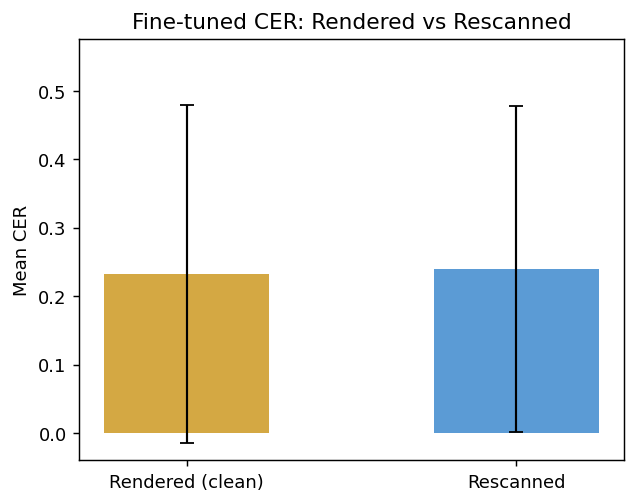
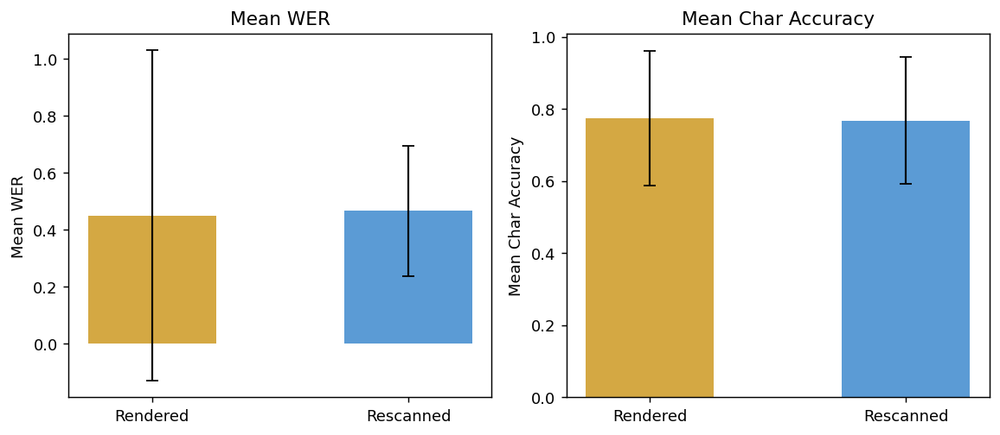
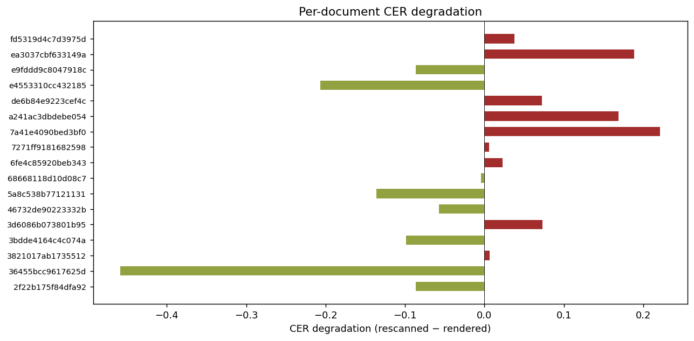
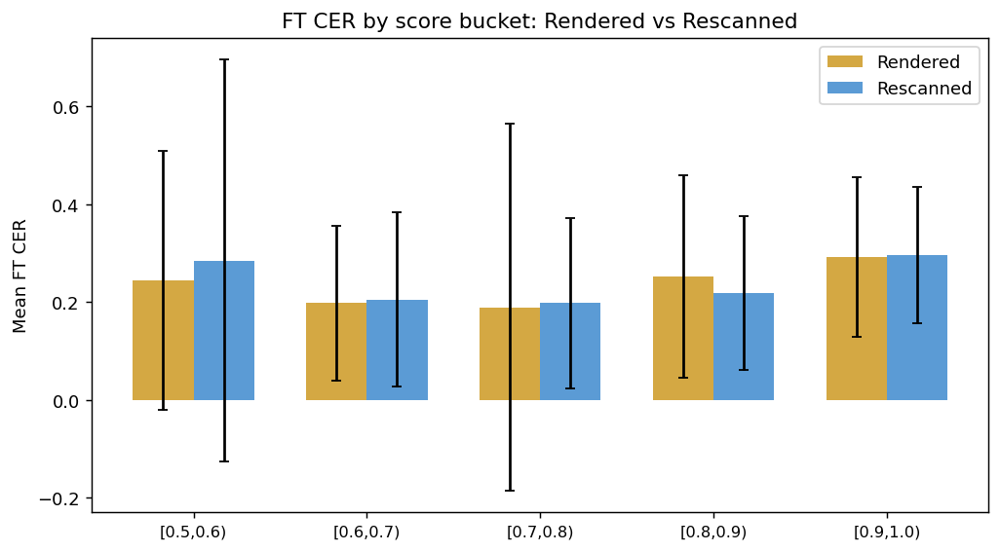
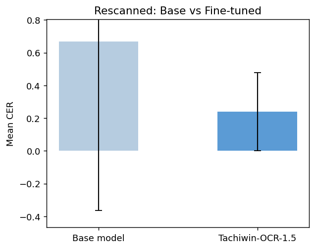

# Rendered vs Rescanned — Comparison Report

Rendered: test_2000 (2000 pages)  ·  Rescanned: test_rescanned (200 pages)  ·  Overlap documents: 17  ·  Run: 2026-07-23 22:00:24

## 1. Overall metrics (Fine-tuned model)

| Metric | Rendered | Rescanned | Δ | Degradation |

|---|---|---|---|---|

| **FT CER ↓** | 0.2323 | 0.2400 | +0.0077 | +3.3% |

| **FT WER ↓** | 0.4494 | 0.4664 | +0.0170 | +3.8% |

| **FT Char Acc ↑** | 0.7743 | 0.7680 | -0.0063 | -0.8% |

| **Base CER ↓** | 0.7729 | 0.6696 | -0.1033 | — |

**Key observation:** Fine-tuned CER degrades by only 
+3.3% relative when pages are rescanned, 
confirming the synthetic training distortions (blur, noise, rotation) generalize well to real-world scanning noise.

## 2. FT CER by score bucket

| Bucket | Rendered n | Rendered CER | Rescanned n | Rescanned CER | Δ |

|---|---|---|---|---|---|

| [0.5,0.6) | 280 | 0.2446 | 40 | 0.2850 | +0.0405 |

| [0.6,0.7) | 424 | 0.1981 | 40 | 0.2055 | +0.0074 |

| [0.7,0.8) | 260 | 0.1896 | 40 | 0.1980 | +0.0085 |

| [0.8,0.9) | 106 | 0.2520 | 40 | 0.2189 | -0.0331 |

| [0.9,1.0) | 242 | 0.2922 | 37 | 0.2953 | +0.0031 |

## 3. Per-document degradation (overlapping PDFs)

| pdf_hash         |   pages_r |   pages_s |   FT_CER_render |   FT_CER_rescan |   base_CER_render |   base_CER_rescan |   FT_WER_render |   FT_WER_rescan |   CER_degrade |   WER_degrade |   ACC_degrade |
|:-----------------|----------:|----------:|----------------:|----------------:|------------------:|------------------:|----------------:|----------------:|--------------:|--------------:|--------------:|
| 7a41e4090bed3bf0 |         3 |         2 |        0.2556   |       0.477     |          0.315633 |          0.5594   |        0.553967 |        0.83785  |    0.2214     |     0.283883  |   -0.2214     |
| ea3037cbf633149a |         3 |         1 |        0.204633 |       0.3931    |          1.4269   |          1.2469   |        0.3769   |        0.4184   |    0.188467   |     0.0415    |   -0.188467   |
| a241ac3dbdebe054 |         3 |         1 |        0.274067 |       0.4429    |          0.2831   |          0.3333   |        0.315033 |        0.4437   |    0.168833   |     0.128667  |   -0.168833   |
| 3d6086b073801b95 |       287 |        66 |        0.185997 |       0.259241  |          0.712585 |          0.936638 |        0.378787 |        0.390706 |    0.073244   |     0.0119186 |   -0.051411   |
| de6b84e9223cef4c |         8 |         5 |        0.251912 |       0.32424   |          0.264412 |          0.3335   |        0.504375 |        0.54636  |    0.0723275  |     0.041985  |   -0.0723275  |
| fd5319d4c7d3975d |         2 |         1 |        0.152    |       0.1895    |          0.2363   |          0.3159   |        0.60265  |        0.8442   |    0.0375     |     0.24155   |   -0.0375     |
| 6fe4c85920beb343 |        33 |        10 |        0.072797 |       0.0957    |          0.130794 |          0.14956  |        0.2811   |        0.30922  |    0.022903   |     0.02812   |   -0.022903   |
| 3821017ab1735512 |       187 |        77 |        0.264345 |       0.270962  |          0.439377 |          0.420871 |        0.627733 |        0.647345 |    0.00661688 |     0.0196123 |   -0.00661688 |
| 7271ff9181682598 |         5 |         3 |        0.02796  |       0.0340667 |          0.1739   |          0.185367 |        0.0841   |        0.104033 |    0.00610667 |     0.0199333 |   -0.00610667 |
| 68668118d10d08c7 |        12 |         7 |        0.031575 |       0.0271286 |          0.124075 |          0.150329 |        0.2169   |        0.177414 |   -0.00444643 |    -0.0394857 |    0.00444643 |
| 46732de90223332b |         6 |         1 |        0.128633 |       0.0713    |          0.815667 |          0.1478   |        0.1791   |        0.1744   |   -0.0573333  |    -0.0047    |    0.0573333  |
| e9fddd9c8047918c |         5 |         1 |        0.1638   |       0.0776    |          1.1948   |          0.0865   |        0.4311   |        0.2073   |   -0.0862     |    -0.2238    |    0.0862     |
| 2f22b175f84dfa92 |        64 |        20 |        0.282305 |       0.196005  |          2.53388  |          1.49526  |        0.33227  |        0.226465 |   -0.0862997  |    -0.105805  |    0.0833856  |
| 3bdde4164c4c074a |         2 |         1 |        0.6106   |       0.5119    |          0.64475  |          0.5797   |        0.3658   |        0.2373   |   -0.0987     |    -0.1285    |    0.0987     |
| 5a8c538b77121131 |         4 |         1 |        0.220825 |       0.0847    |          1.14827  |          0.614    |        0.342275 |        0.1847   |   -0.136125   |    -0.157575  |    0.136125   |
| e4553310cc432185 |        17 |         1 |        0.304012 |       0.0976    |          0.314671 |          0.0741   |        0.313676 |        0.25     |   -0.206412   |    -0.0636765 |    0.110765   |
| 36455bcc9617625d |        14 |         2 |        0.665586 |       0.20695   |          0.724721 |          0.24805  |        0.832729 |        0.6528   |   -0.458636   |    -0.179929  |    0.164114   |

**Summary:** Out of 17 overlapping documents, 
9 show higher CER on rescanned pages, 8 show lower or equal CER. 
Mean CER degradation across all docs: -0.0198.

## 4. Per-superlanguage comparison

| superlanguage | Pages_r | FT CER_r | Pages_s | FT CER_s | Δ CER |

|---|---|---|---|---|---|

| Amuzgo | 328 | 0.2185 | 66 | 0.2592 | +0.0407 |

| Chinanteco | 412 | 0.2972 | 78 | 0.2686 | -0.0286 |

| Mazateco | 117 | 0.2244 | 32 | 0.1677 | -0.0567 |

| Mixteco | 146 | 0.2137 | 6 | 0.1879 | -0.0258 |

| Popoluca | 16 | 0.0766 | 8 | 0.0791 | +0.0025 |

| Zapoteco | 319 | 0.2494 | 3 | 0.2597 | +0.0103 |

## 4. Per-family comparison

| family | Pages_r | FT CER_r | Pages_s | FT CER_s | Δ CER |

|---|---|---|---|---|---|

| Mixe-Zoqueano | 16 | 0.0766 | 8 | 0.0791 | +0.0025 |

| Otomangue | 1512 | 0.2388 | 185 | 0.2450 | +0.0062 |

## 4. Per-collection comparison

| collection | Pages_r | FT CER_r | Pages_s | FT CER_s | Δ CER |

|---|---|---|---|---|---|

| dictionary | 643 | 0.2233 | 82 | 0.2742 | +0.0509 |

| grammar | 632 | 0.2030 | 66 | 0.2592 | +0.0562 |

| legal | 12 | 0.0316 | 7 | 0.0271 | -0.0045 |

| writing_rules | 35 | 0.2685 | 4 | 0.1567 | -0.1118 |

---
*Report generated 2026-07-23 22:00:24*