# Tachiwin-OCR-1.5 Evaluation Report

200-page benchmark · uncommon_char_score ≥ 0.5  |  Run: 2026-07-23 21:50:44 · rescanned-200

**Base model:** [PaddleOCR-VL-1.5](https://huggingface.co/PaddlePaddle/PaddleOCR-VL-1.5)  ·  **Fine-tuned model:** [Tachiwin-OCR-1.5](https://huggingface.co/tachiwin/Tachiwin-OCR-1.5)

Significance (paired t-test, base CER vs fine-tuned CER within group): *** p<0.001  ** p<0.01  * p<0.05  ns=not significant

Overall: base CER 0.6696 → ft CER 0.2400 (−36.4% relative)

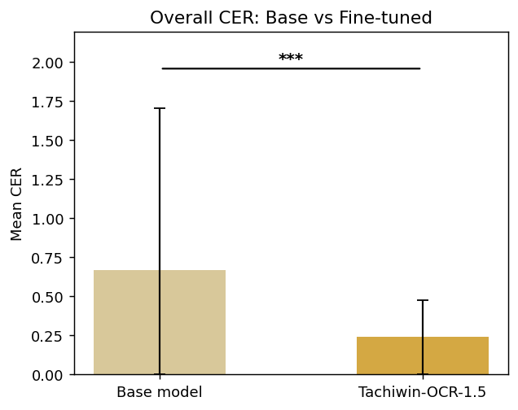

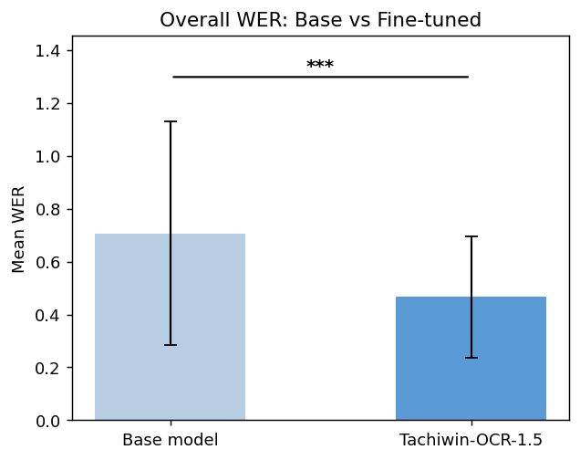

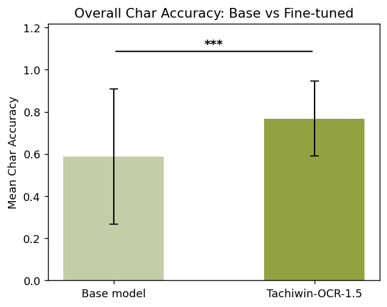

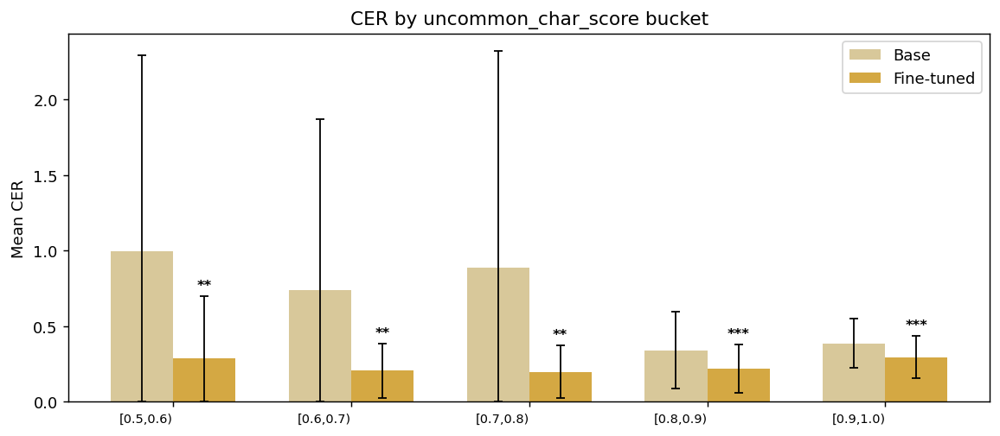

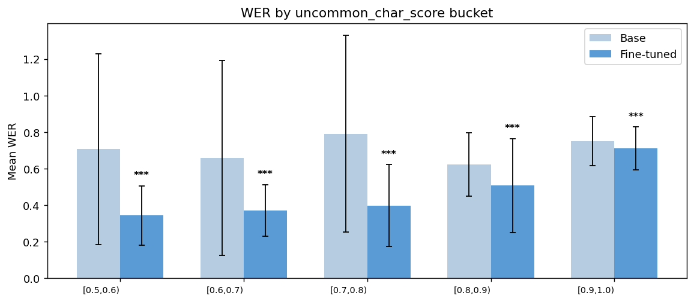

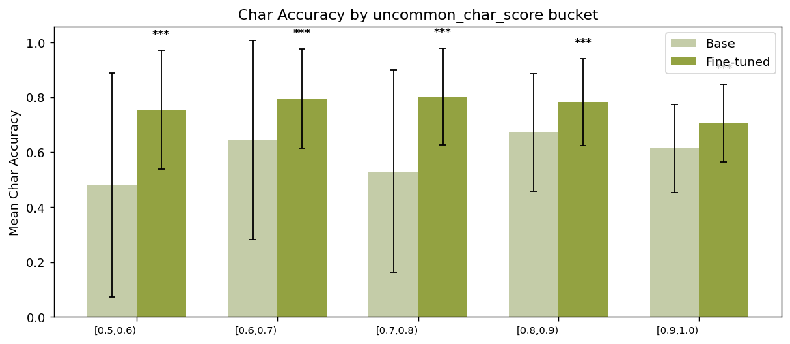

## By uncommon_char_score bucket

| Score range   |   Pages |   Base CER |   Fine-tuned CER | CER Improvement   |   Base WER |   Fine-tuned WER |   Base Char Accuracy |   Fine-tuned Char Accuracy |   p-value | Significance   |
|:--------------|--------:|-----------:|-----------------:|:------------------|-----------:|-----------------:|---------------------:|---------------------------:|----------:|:---------------|
| [0.5, 0.6)    |      40 |     0.9967 |           0.285  | 71.4%             |     0.7069 |           0.3433 |               0.4801 |                     0.7551 |   0.00105 | **             |
| [0.6, 0.7)    |      40 |     0.7382 |           0.2055 | 72.2%             |     0.6579 |           0.3715 |               0.6435 |                     0.7945 |   0.00186 | **             |
| [0.7, 0.8)    |      40 |     0.8864 |           0.198  | 77.7%             |     0.79   |           0.3983 |               0.5298 |                     0.802  |   0.00368 | **             |
| [0.8, 0.9)    |      40 |     0.3404 |           0.2189 | 35.7%             |     0.623  |           0.5079 |               0.6714 |                     0.7811 |   0.00028 | ***            |
| [0.9, 1.0)    |      37 |     0.3875 |           0.2953 | 23.8%             |     0.7497 |           0.7112 |               0.6125 |                     0.7047 |   2e-05   | ***            |

## By code (n ≥ 3)

| code   |   Pages |   Base CER |   Fine-tuned CER | CER Improvement   |   Base WER |   Fine-tuned WER |   Base Char Accuracy |   Fine-tuned Char Accuracy |   p-value | Significance   |
|:-------|--------:|-----------:|-----------------:|:------------------|-----------:|-----------------:|---------------------:|---------------------------:|----------:|:---------------|
| chz    |      77 |     0.4209 |           0.271  | 35.6%             |     0.7001 |           0.6473 |               0.6309 |                     0.729  |   0.00938 | **             |
| amu    |      66 |     0.9366 |           0.2592 | 72.3%             |     0.7387 |           0.3907 |               0.4963 |                     0.7651 |   0       | ***            |
| maj    |      20 |     1.4953 |           0.196  | 86.9%             |     0.9096 |           0.2265 |               0.4368 |                     0.804  |   0.00879 | **             |
| vmp    |      10 |     0.1496 |           0.0957 | 36.0%             |     0.375  |           0.3092 |               0.8504 |                     0.9043 |   0.00026 | ***            |
| poi    |       8 |     0.1732 |           0.0791 | 54.3%             |     0.6355 |           0.2107 |               0.8268 |                     0.9209 |   0.03501 | *              |
| zad    |       7 |     0.3091 |           0.2907 | 5.9%              |     0.614  |           0.5768 |               0.6909 |                     0.7093 |   0.26053 | ns             |
| meh    |       3 |     0.1854 |           0.0341 | 81.6%             |     0.5152 |           0.104  |               0.8146 |                     0.9659 |   0.06693 | ns             |

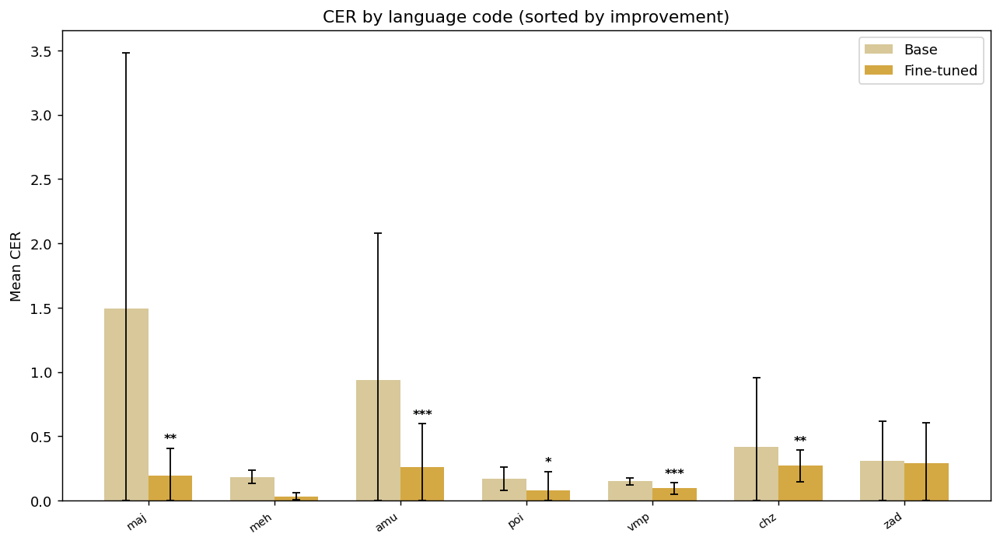

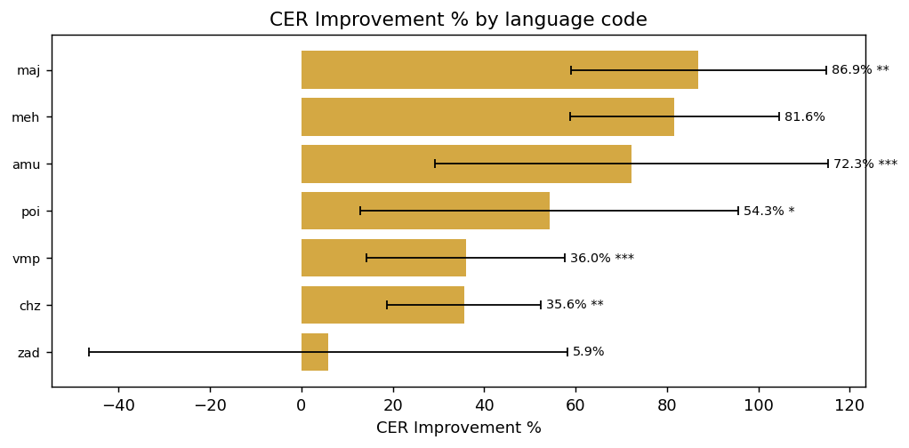

## By superlanguage (n ≥ 3)

| superlanguage   |   Pages |   Base CER |   Fine-tuned CER | CER Improvement   |   Base WER |   Fine-tuned WER |   Base Char Accuracy |   Fine-tuned Char Accuracy |   p-value | Significance   |
|:----------------|--------:|-----------:|-----------------:|:------------------|-----------:|-----------------:|---------------------:|---------------------------:|----------:|:---------------|
| Chinanteco      |      78 |     0.4233 |           0.2686 | 36.6%             |     0.6994 |           0.6414 |               0.6278 |                     0.7314 |   0.00687 | **             |
| Amuzgo          |      66 |     0.9366 |           0.2592 | 72.3%             |     0.7387 |           0.3907 |               0.4963 |                     0.7651 |   0       | ***            |
| Mazateco        |      32 |     1.0226 |           0.1677 | 83.6%             |     0.7172 |           0.2591 |               0.5677 |                     0.8323 |   0.00686 | **             |
| Popoluca        |       8 |     0.1732 |           0.0791 | 54.3%             |     0.6355 |           0.2107 |               0.8268 |                     0.9209 |   0.03501 | *              |
| Mixteco         |       6 |     0.3038 |           0.1879 | 38.1%             |     0.6245 |           0.3604 |               0.6962 |                     0.8121 |   0.01608 | *              |
| Zapoteco        |       3 |     0.3274 |           0.2597 | 20.7%             |     0.5952 |           0.4296 |               0.6726 |                     0.7403 |   0.18406 | ns             |

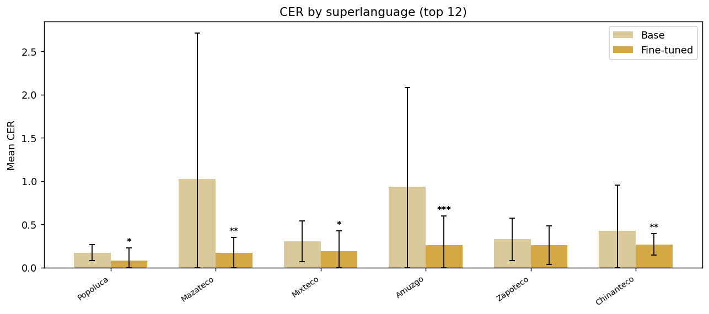

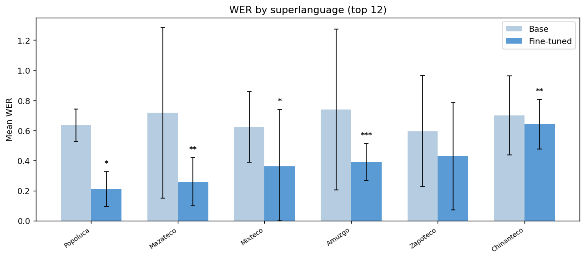

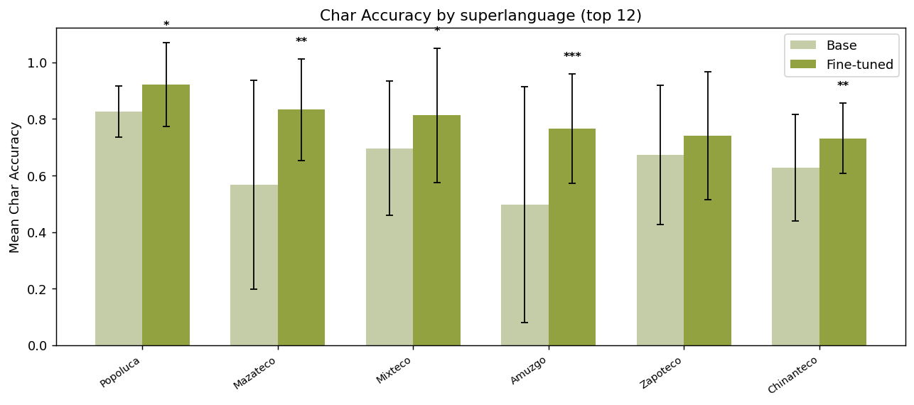

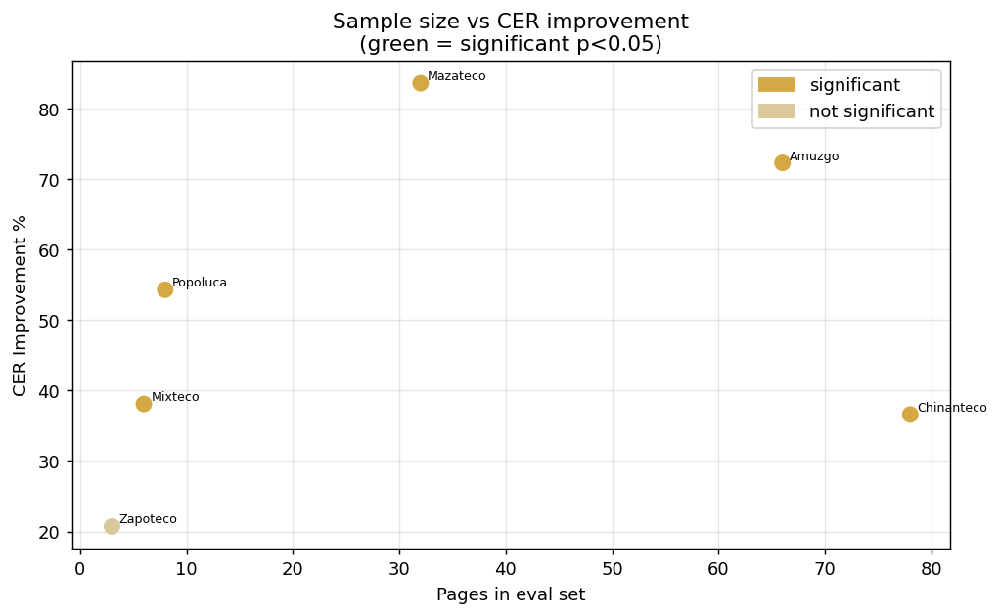

## By family (n ≥ 3)

| family        |   Pages |   Base CER |   Fine-tuned CER | CER Improvement   |   Base WER |   Fine-tuned WER |   Base Char Accuracy |   Fine-tuned Char Accuracy |   p-value | Significance   |
|:--------------|--------:|-----------:|-----------------:|:------------------|-----------:|-----------------:|---------------------:|---------------------------:|----------:|:---------------|
| Otomangue     |     185 |     0.7047 |           0.245  | 65.2%             |     0.7124 |           0.4733 |               0.5734 |                     0.7636 |   0       | ***            |
| Mixe-Zoqueano |       8 |     0.1732 |           0.0791 | 54.3%             |     0.6355 |           0.2107 |               0.8268 |                     0.9209 |   0.03501 | *              |

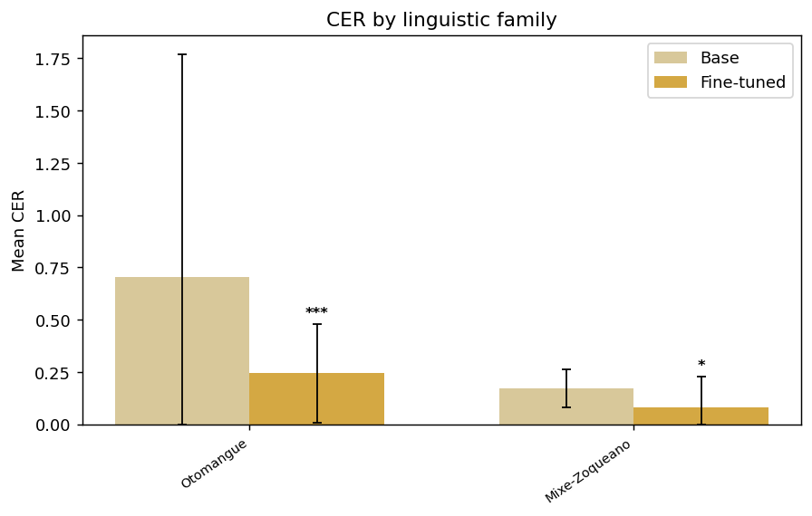

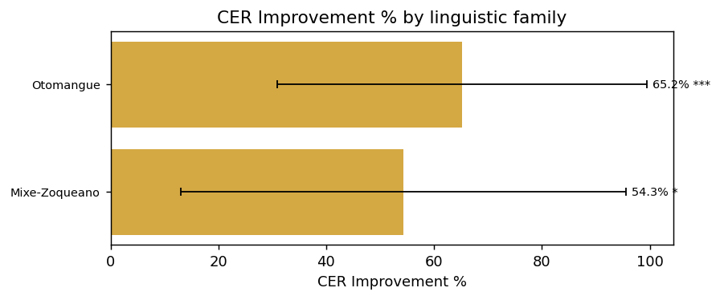

## By collection (n ≥ 3)

| collection    |   Pages |   Base CER |   Fine-tuned CER | CER Improvement   |   Base WER |   Fine-tuned WER |   Base Char Accuracy |   Fine-tuned Char Accuracy |   p-value | Significance   |
|:--------------|--------:|-----------:|-----------------:|:------------------|-----------:|-----------------:|---------------------:|---------------------------:|----------:|:---------------|
| dictionary    |      82 |     0.4155 |           0.2742 | 34.0%             |     0.6908 |           0.6412 |               0.6331 |                     0.7258 |   0.00915 | **             |
| grammar       |      66 |     0.9366 |           0.2592 | 72.3%             |     0.7387 |           0.3907 |               0.4963 |                     0.7651 |   0       | ***            |
| legal         |       7 |     0.1503 |           0.0271 | 82.0%             |     0.6648 |           0.1774 |               0.8497 |                     0.9729 |   0.00245 | **             |
| writing_rules |       4 |     0.5238 |           0.1567 | 70.1%             |     0.5252 |           0.2462 |               0.5379 |                     0.8433 |   0.16248 | ns             |

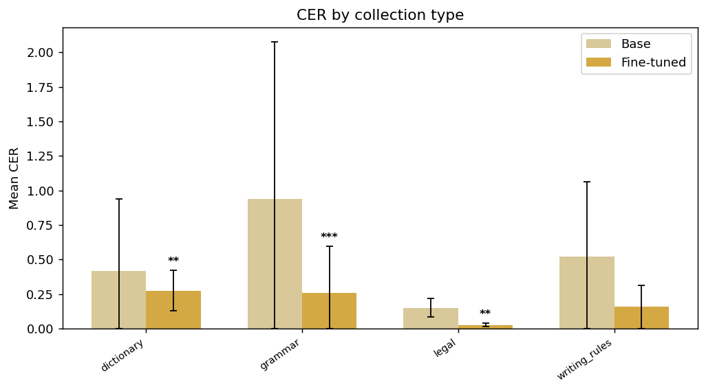

## By source (n ≥ 3)

| source     |   Pages |   Base CER |   Fine-tuned CER | CER Improvement   |   Base WER |   Fine-tuned WER |   Base Char Accuracy |   Fine-tuned Char Accuracy |   p-value | Significance   |
|:-----------|--------:|-----------:|-----------------:|:------------------|-----------:|-----------------:|---------------------:|---------------------------:|----------:|:---------------|
| ilv        |     182 |     0.72   |           0.255  | 64.6%             |     0.7271 |           0.4863 |               0.5627 |                     0.7538 |   0       | ***            |
| books      |      10 |     0.1496 |           0.0957 | 36.0%             |     0.375  |           0.3092 |               0.8504 |                     0.9043 |   0.00026 | ***            |
| government |       7 |     0.1503 |           0.0271 | 82.0%             |     0.6648 |           0.1774 |               0.8497 |                     0.9729 |   0.00245 | **             |

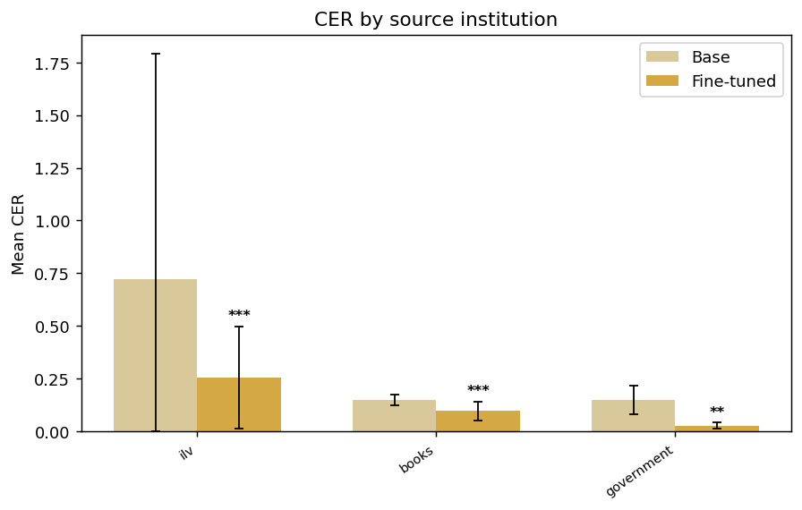

## By document (17 PDFs)

### chz Diccionario chinanteco Ayotzintepec

`3821017ab1735512...`

| Field         | Value                                   |
|:--------------|:----------------------------------------|
| name          | chz Diccionario chinanteco Ayotzintepec |
| code          | chz                                     |
| language      | chinanteco del sureste alto             |
| superlanguage | Chinanteco                              |
| family        | Otomangue                               |
| collection    | dictionary                              |
| source        | ilv                                     |
| Pages         | 77                                      |

|   Base CER |   Fine-tuned CER | CER Improvement   |   Base WER |   Fine-tuned WER |   Base Char Accuracy |   Fine-tuned Char Accuracy |
|-----------:|-----------------:|:------------------|-----------:|-----------------:|---------------------:|---------------------------:|
|     0.4209 |            0.271 | 35.6%             |     0.7001 |           0.6473 |               0.6309 |                      0.729 |

### amu gramatica

`3d6086b073801b95...`

| Field         | Value            |
|:--------------|:-----------------|
| name          | amu gramatica    |
| code          | amu              |
| language      | amuzgo del norte |
| superlanguage | Amuzgo           |
| family        | Otomangue        |
| collection    | grammar          |
| source        | ilv              |
| Pages         | 66               |

|   Base CER |   Fine-tuned CER | CER Improvement   |   Base WER |   Fine-tuned WER |   Base Char Accuracy |   Fine-tuned Char Accuracy |
|-----------:|-----------------:|:------------------|-----------:|-----------------:|---------------------:|---------------------------:|
|     0.9366 |           0.2592 | 72.3%             |     0.7387 |           0.3907 |               0.4963 |                     0.7651 |

### maj Tinchiyai

`2f22b175f84dfa92...`

| Field         | Value                  |
|:--------------|:-----------------------|
| name          | maj Tinchiyai          |
| code          | maj                    |
| language      | mazateco del este bajo |
| superlanguage | Mazateco               |
| family        | Otomangue              |
| source        | ilv                    |
| Pages         | 20                     |

|   Base CER |   Fine-tuned CER | CER Improvement   |   Base WER |   Fine-tuned WER |   Base Char Accuracy |   Fine-tuned Char Accuracy |
|-----------:|-----------------:|:------------------|-----------:|-----------------:|---------------------:|---------------------------:|
|     1.4953 |            0.196 | 86.9%             |     0.9096 |           0.2265 |               0.4368 |                      0.804 |

### vmp const cdmx

`6fe4c85920beb343...`

| Field         | Value                |
|:--------------|:---------------------|
| name          | vmp const cdmx       |
| code          | vmp                  |
| language      | mazateco del noreste |
| superlanguage | Mazateco             |
| family        | Otomangue            |
| source        | books                |
| Pages         | 10                   |

|   Base CER |   Fine-tuned CER | CER Improvement   |   Base WER |   Fine-tuned WER |   Base Char Accuracy |   Fine-tuned Char Accuracy |
|-----------:|-----------------:|:------------------|-----------:|-----------------:|---------------------:|---------------------------:|
|     0.1496 |           0.0957 | 36.0%             |      0.375 |           0.3092 |               0.8504 |                     0.9043 |

### poi

`68668118d10d08c7...`

| Field         | Value                 |
|:--------------|:----------------------|
| name          | poi                   |
| code          | poi                   |
| language      | popoluca de la Sierra |
| superlanguage | Popoluca              |
| family        | Mixe-Zoqueano         |
| collection    | legal                 |
| source        | government            |
| Pages         | 7                     |

|   Base CER |   Fine-tuned CER | CER Improvement   |   Base WER |   Fine-tuned WER |   Base Char Accuracy |   Fine-tuned Char Accuracy |
|-----------:|-----------------:|:------------------|-----------:|-----------------:|---------------------:|---------------------------:|
|     0.1503 |           0.0271 | 82.0%             |     0.6648 |           0.1774 |               0.8497 |                     0.9729 |

### zad Mi peque%C3%B1o diccionario ilustrado

`de6b84e9223cef4c...`

| Field      | Value                                     |
|:-----------|:------------------------------------------|
| name       | zad Mi peque%C3%B1o diccionario ilustrado |
| code       | zad                                       |
| collection | dictionary                                |
| source     | ilv                                       |
| Pages      | 5                                         |

|   Base CER |   Fine-tuned CER | CER Improvement   |   Base WER |   Fine-tuned WER |   Base Char Accuracy |   Fine-tuned Char Accuracy |
|-----------:|-----------------:|:------------------|-----------:|-----------------:|---------------------:|---------------------------:|
|     0.3335 |           0.3242 | 2.8%              |     0.5484 |           0.5464 |               0.6665 |                     0.6758 |

### meh gato

`7271ff9181682598...`

| Field         | Value                |
|:--------------|:---------------------|
| name          | meh gato             |
| code          | meh                  |
| language      | mixteco del suroeste |
| superlanguage | Mixteco              |
| family        | Otomangue            |
| source        | ilv                  |
| Pages         | 3                    |

|   Base CER |   Fine-tuned CER | CER Improvement   |   Base WER |   Fine-tuned WER |   Base Char Accuracy |   Fine-tuned Char Accuracy |
|-----------:|-----------------:|:------------------|-----------:|-----------------:|---------------------:|---------------------------:|
|     0.1854 |           0.0341 | 81.6%             |     0.5152 |            0.104 |               0.8146 |                     0.9659 |

### zad Adivinanzas

`36455bcc9617625d...`

| Field   | Value           |
|:--------|:----------------|
| name    | zad Adivinanzas |
| code    | zad             |
| source  | ilv             |
| Pages   | 2               |

|   Base CER |   Fine-tuned CER | CER Improvement   |   Base WER |   Fine-tuned WER |   Base Char Accuracy |   Fine-tuned Char Accuracy |
|-----------:|-----------------:|:------------------|-----------:|-----------------:|---------------------:|---------------------------:|
|      0.248 |            0.207 | 16.6%             |     0.7778 |           0.6528 |                0.752 |                      0.793 |

### jmx construir casas adobe

`7a41e4090bed3bf0...`

| Field         | Value                     |
|:--------------|:--------------------------|
| name          | jmx construir casas adobe |
| code          | jmx                       |
| language      | mixteco del oeste         |
| superlanguage | Mixteco                   |
| family        | Otomangue                 |
| source        | ilv                       |
| Pages         | 2                         |

|   Base CER |   Fine-tuned CER | CER Improvement   |   Base WER |   Fine-tuned WER |   Base Char Accuracy |   Fine-tuned Char Accuracy |
|-----------:|-----------------:|:------------------|-----------:|-----------------:|---------------------:|---------------------------:|
|     0.5594 |            0.477 | 14.7%             |     0.9012 |           0.8378 |               0.4406 |                      0.523 |

### mim convOrt

`46732de90223332b...`

| Field         | Value                       |
|:--------------|:----------------------------|
| name          | mim convOrt                 |
| code          | mim                         |
| language      | mixteco central de Guerrero |
| superlanguage | Mixteco                     |
| family        | Otomangue                   |
| collection    | writing_rules               |
| source        | ilv                         |
| Pages         | 1                           |

|   Base CER |   Fine-tuned CER | CER Improvement   |   Base WER |   Fine-tuned WER |   Base Char Accuracy |   Fine-tuned Char Accuracy |
|-----------:|-----------------:|:------------------|-----------:|-----------------:|---------------------:|---------------------------:|
|     0.1478 |           0.0713 | 51.8%             |     0.3992 |           0.1744 |               0.8522 |                     0.9287 |

### cle propusta convenciones escribir

`5a8c538b77121131...`

| Field         | Value                              |
|:--------------|:-----------------------------------|
| name          | cle propusta convenciones escribir |
| code          | cle                                |
| language      | chinanteco central                 |
| superlanguage | Chinanteco                         |
| family        | Otomangue                          |
| collection    | writing_rules                      |
| source        | ilv                                |
| Pages         | 1                                  |

|   Base CER |   Fine-tuned CER | CER Improvement   |   Base WER |   Fine-tuned WER |   Base Char Accuracy |   Fine-tuned Char Accuracy |
|-----------:|-----------------:|:------------------|-----------:|-----------------:|---------------------:|---------------------------:|
|      0.614 |           0.0847 | 86.2%             |     0.6433 |           0.1847 |                0.386 |                     0.9153 |

### zca benito juarez

`3bdde4164c4c074a...`

| Field         | Value                      |
|:--------------|:---------------------------|
| name          | zca benito juarez          |
| code          | zca                        |
| language      | zapoteco de Valles del sur |
| superlanguage | Zapoteco                   |
| family        | Otomangue                  |
| source        | ilv                        |
| Pages         | 1                          |

|   Base CER |   Fine-tuned CER | CER Improvement   |   Base WER |   Fine-tuned WER |   Base Char Accuracy |   Fine-tuned Char Accuracy |
|-----------:|-----------------:|:------------------|-----------:|-----------------:|---------------------:|---------------------------:|
|     0.5797 |           0.5119 | 11.7%             |     0.5763 |           0.2373 |               0.4203 |                     0.4881 |

### popoluca-de-la-sierra-guia-atencion-pueblos-indigenas-afrome

`a241ac3dbdebe054...`

| Field         | Value                                                                      |
|:--------------|:---------------------------------------------------------------------------|
| name          | popoluca-de-la-sierra-guia-atencion-pueblos-indigenas-afromexicano-covid19 |
| code          | poi                                                                        |
| language      | popoluca de la Sierra                                                      |
| superlanguage | Popoluca                                                                   |
| family        | Mixe-Zoqueano                                                              |
| collection    | covid                                                                      |
| source        | ssa                                                                        |
| Pages         | 1                                                                          |

|   Base CER |   Fine-tuned CER | CER Improvement   |   Base WER |   Fine-tuned WER |   Base Char Accuracy |   Fine-tuned Char Accuracy |
|-----------:|-----------------:|:------------------|-----------:|-----------------:|---------------------:|---------------------------:|
|     0.3333 |           0.4429 | -32.9%            |       0.43 |           0.4437 |               0.6667 |                     0.5571 |

### vmz Tiempo

`e4553310cc432185...`

| Field         | Value                 |
|:--------------|:----------------------|
| name          | vmz Tiempo            |
| code          | vmz                   |
| language      | mazateco del suroeste |
| superlanguage | Mazateco              |
| family        | Otomangue             |
| source        | ilv                   |
| Pages         | 1                     |

|   Base CER |   Fine-tuned CER | CER Improvement   |   Base WER |   Fine-tuned WER |   Base Char Accuracy |   Fine-tuned Char Accuracy |
|-----------:|-----------------:|:------------------|-----------:|-----------------:|---------------------:|---------------------------:|
|     0.0741 |           0.0976 | -31.7%            |     0.1857 |             0.25 |               0.9259 |                     0.9024 |

### zpc ConvOrth

`e9fddd9c8047918c...`

| Field         | Value                          |
|:--------------|:-------------------------------|
| name          | zpc ConvOrth                   |
| code          | zpc                            |
| language      | zapoteco del oeste de Tuxtepec |
| superlanguage | Zapoteco                       |
| family        | Otomangue                      |
| collection    | writing_rules                  |
| source        | ilv                            |
| Pages         | 1                              |

|   Base CER |   Fine-tuned CER | CER Improvement   |   Base WER |   Fine-tuned WER |   Base Char Accuracy |   Fine-tuned Char Accuracy |
|-----------:|-----------------:|:------------------|-----------:|-----------------:|---------------------:|---------------------------:|
|     0.0865 |           0.0776 | 10.3%             |     0.2354 |           0.2073 |               0.9135 |                     0.9224 |

### maa propuesta escribir eloxochitlan

`ea3037cbf633149a...`

| Field         | Value                               |
|:--------------|:------------------------------------|
| name          | maa propuesta escribir eloxochitlan |
| code          | maa                                 |
| language      | mazateco de Tecóatl                 |
| superlanguage | Mazateco                            |
| family        | Otomangue                           |
| collection    | writing_rules                       |
| source        | ilv                                 |
| Pages         | 1                                   |

|   Base CER |   Fine-tuned CER | CER Improvement   |   Base WER |   Fine-tuned WER |   Base Char Accuracy |   Fine-tuned Char Accuracy |
|-----------:|-----------------:|:------------------|-----------:|-----------------:|---------------------:|---------------------------:|
|     1.2469 |           0.3931 | 68.5%             |     0.8227 |           0.4184 |                    0 |                     0.6069 |

### ztg varios tipos salsas

`fd5319d4c7d3975d...`

| Field         | Value                                       |
|:--------------|:--------------------------------------------|
| name          | ztg varios tipos salsas                     |
| code          | ztg                                         |
| language      | zapoteco de la Sierra sur, del sureste alto |
| superlanguage | Zapoteco                                    |
| family        | Otomangue                                   |
| source        | ilv                                         |
| Pages         | 1                                           |

|   Base CER |   Fine-tuned CER | CER Improvement   |   Base WER |   Fine-tuned WER |   Base Char Accuracy |   Fine-tuned Char Accuracy |
|-----------:|-----------------:|:------------------|-----------:|-----------------:|---------------------:|---------------------------:|
|     0.3159 |           0.1895 | 40.0%             |      0.974 |           0.8442 |               0.6841 |                     0.8105 |
